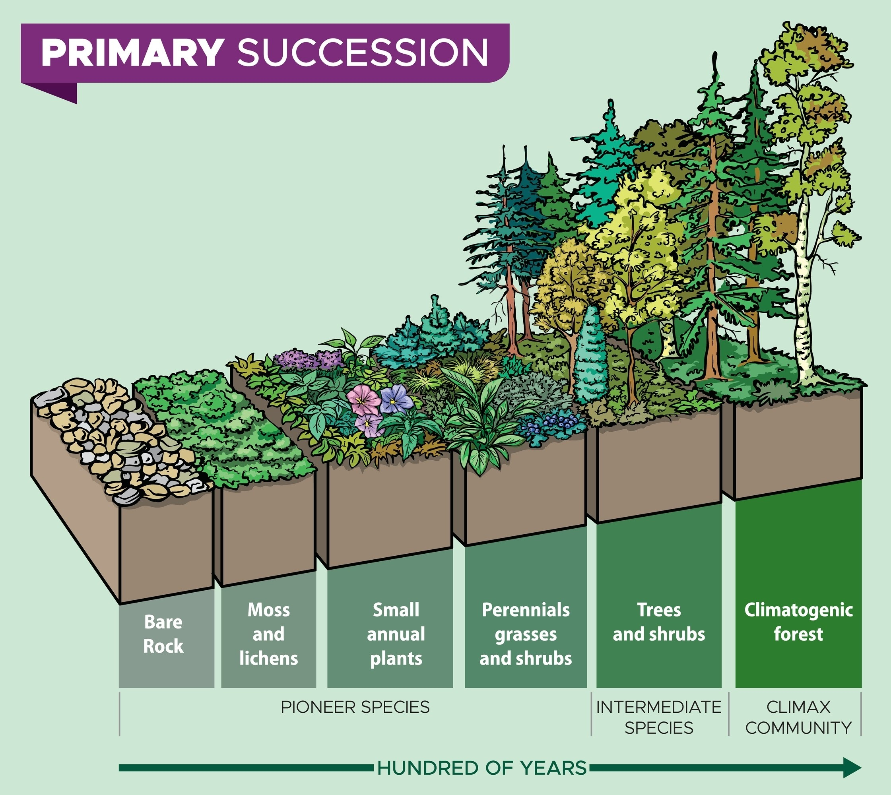

Help me plan the coding for a web assembly city simulation game. The most important aspect for performance will be using DOTS to allow processing lots of events quickly

We can probably aim for 30k entities to get started

We'll have mostly static entities, the cars and pedestrians will be used to give the idea of movement and density throughout the city

Electricity and water should flow to buildings that are connected to pipes/wires or touching buildings that have them

On/off is fine. But we want capacity so the player can't use 1 small power plant or water station for the entire city

To handle capacity while keeping things binary (either it's on or it's off), you need a **Resource Accounting System**. Since we are using DOTS, we want to avoid complex objects. Instead, we’ll treat each "Utility Network" as a single data entry that summarizes the capacity of all connected plants.

Here is how you can structure this for 30,000 entities without killing your frame rate.

---

## **1\. The "Network ID" Strategy**

Instead of calculating flow from every single building to every single plant, you group them into **Sub-grids**.

1. **System 1 (Graph Traversal):** Every time a player places or deletes a building/pipe, run a quick BFS (Breadth-First Search) on your grid.
2. **Assign IDs:** Every connected "island" of buildings gets a unique `NetworkID`.
   - _Island A (Network 1):_ 1 Power Plant + 500 Houses.
   - _Island B (Network 2):_ 0 Power Plants + 10 Houses (Unpowered).
3. **Metadata Table:** In Wasm memory, keep a small array/table for these IDs:

| Network ID | Total Supply | Total Demand | Status     |
| ---------- | ------------ | ------------ | ---------- |
| 1          | 1000         | 500          | Sufficient |
| 2          | 0            | 10           | Critical   |

---

## **2\. The Two-Pass Accounting System**

This is where DOTS shines. You process the 30k entities in two lightning-fast passes.

### **Pass 1: Aggregation (The "Sum")**

A system iterates through all entities with `UtilityConsumer` or `UtilityProducer` components.

- **If Producer:** Look up its `NetworkID` and add its capacity to the `Total Supply` for that ID in the Metadata Table.
- **If Consumer:** Look up its `NetworkID` and add its requirement to the `Total Demand`.

### **Pass 2: Distribution (The "Apply")**

Now that the totals are calculated, another system runs through the entities again:

- **If** `Total Supply >= Total Demand`**:** All entities in that Network ID get `is_powered = true`.
- **If** `Total Supply < Total Demand`**:** You have a "Brownout."

---

## **3\. Handling Brownouts (Who loses power?)**

If you have 100 capacity but 110 demand, who gets the lights? You have two DOTS-friendly options:

- **Option A: Global Failure (Simple):** The whole network turns off if demand is too high. This forces the player to fix it immediately.
- **Option B: Distance-Based Priority (Realistic):** During Pass 1, you store the "Distance from Source" in each entity. In Pass 2, you power entities until the supply runs out, starting with the ones closest to the plants (_Distance_\=0).

---

## **4\. Wasm Implementation Details**

To keep this efficient in WebAssembly, your Metadata Table should just be a flat `Int32Array`.

- **Fixed Size:** If your city has 30k entities, you’ll never have more than 30k "islands" (and usually way fewer). Pre-allocate an array of size 30,000 to store `supply` and `demand` values.
- **Atomic Operations:** If you are using Web Workers, use `Atomics.add()` to sum up the supply and demand safely across multiple threads.

---

## **5\. Coding the "Conductivity"**

Since buildings pass power by touching, your BFS logic looks like this:

```rust
// Simplified logic for a Wasm/Rust system
for entity in query.iter() {
let neighbors = get_neighbors(entity.pos);
for neighbor in neighbors {
if neighbor.is_conductive {
union_sets(entity.id, neighbor.id); // Merge into same NetworkID
}
}
}
```

By using a **Disjoint Set Union (DSU)** algorithm, you can group 30,000 entities into networks in almost _O_(_n_) time. It’s incredibly efficient for this scale.

---

## **6\. Visualizing Shortages**

To make the game feel "alive," don't just use a UI menu. Use the data in the Metadata Table to drive your rendering:

- If `Supply / Demand < 1.0`, multiply the light intensity of the buildings in that network by that fraction.
- The city will literally "dim" as it runs out of power before flickering out.

How do you want to handle the UI for this? Should the player see "Power Lines" overlays, or should the connection status be mostly invisible until something breaks?

I like the dimming before power runs out approach

The "dimming" effect is great because it provides immediate, intuitive feedback to the player without needing a pop-up warning. In a DOTS-based Wasm engine, this is handled by piping a single float from your **Logic Systems** to your **Render Buffers**.

Here is how to plan the code for the dimming and flickering logic.

---

## **1\. The Data Structure**

You need to store the "Health" of the power grid at the network level and then reflect it on each building.

- **Network Metadata (Global):**
  - `supply`: Total Watts produced.
  - `demand`: Total Watts requested.
  - `load_factor`: A calculated float where 1.0 is perfect and 0.0 is total blackout.
- **Building Component (Per Entity):**
  - `network_id`: Which grid it belongs to.
  - `visual_intensity`: The current brightness value (sent to the GPU).

---

## **2\. The Logic: Calculating the Load Factor**

In your Wasm logic loop (after the BFS has grouped buildings into networks), run a system to calculate the power state:

load_factor = clamp(supply / demand, 0.0, 1.0)

### **Implementing "Brownout" Behavior**

Instead of just a flat dimming, you can use the `load_factor` to trigger different visual states:

- **1.0:** Full Brightness.
- **0.7 - 0.9:** Noticeable dimming.
- **0.3 - 0.7:** Aggressive flickering + dimming.
- ** < 0.3:** Total darkness (Blackout).

---

## **3\. The Visual System: Adding "Jitter"**

To make the dimming look like a struggling electrical grid rather than a simple opacity change, add a **Time-based Noise** function to your Wasm system.

```rust
// Run this every frame for all powered buildings
fn update_visuals(time: f32, network: &Network, building: &mut VisualComponent) {
let ratio = network.load_factor;
```

    `if ratio < 1.0 {`
        `// Create a flicker effect using a sine wave + some random noise`
        `let flicker = (time * 20.0).sin() * (1.0 - ratio) * 0.5;`
        `building.intensity = (ratio + flicker).clamp(0.0, 1.0);`
    `} else {`
        `building.intensity = 1.0;`
    `}`

`}`

---

## **4\. The DOTS-to-GPU Pipeline**

This is the most critical part for performance. Since you have 30,000 entities, you cannot update 30,000 individual materials in JavaScript.

1. **Shared Memory:** Your Wasm module and your WebGL/WebGPU renderer should share a `SharedArrayBuffer`.
2. **Instance Attributes:** When you draw your buildings using **Instanced Rendering**, you pass an array of `intensity` values as a vertex attribute.
3. **Shader Logic:** Inside your Fragment Shader, multiply the base texture color by this `intensity` attribute.

```glsl
// Fragment Shader snippet
precision medium_uip float;
varying float v_intensity; // Passed from Wasm via Instance Buffer
```

`void main() {`  
 `vec4 texColor = texture2D(u_sampler, v_texCoord);`  
 `gl_FragColor = vec4(texColor.rgb * v_intensity, texColor.a);`  
`}`

---

## **5\. Performance Optimization: The "Dormant" State**

Updating 30k flickering buildings every frame is still a lot of work. Use your **Dirty Flags** here:

- If `load_factor == 1.0`, the building is "Stable." Do not update its `intensity` every frame.
- Only run the flicker/dimming logic on entities belonging to a `NetworkID` where `supply < demand`.
- This keeps your "Rush Hour" performance high because only the "broken" parts of the city cost extra CPU cycles.

---

## **6\. Planning for Scale**

For 30,000 entities, the memory layout for this system would look like this in your Wasm linear memory:

| Entity Index | Network ID | Supply (W) | Demand (W) | Intensity (Float32) |
| ------------ | ---------- | ---------- | ---------- | ------------------- |
| 0            | 1          | 0          | 50         | 0.82                |
| 1            | 1          | 0          | 50         | 0.82                |
| ...          | ...        | ...        | ...        | ...                 |

By keeping `Intensity` in its own contiguous `Float32Array`, you can upload the entire block of 30,000 floats to the GPU in one `gl.bufferSubData` call.

Since we are doing this in Wasm, are you leaning towards using **Rust** for the memory safety, or **AssemblyScript/C++** for a more direct mapping to JavaScript?

---

I'm leaning towards Rust, as we can recompile natively when moving to other platforms

Choosing **Rust** is a powerhouse move for this. It gives you the best of both worlds: memory safety that prevents the nightmare of debugging "SharedArrayBuffer" race conditions, and a clear path to compile for Windows, Mac, or Linux with almost zero code changes.

For a DOTS-based city sim in Rust, your best bet is **Bevy ECS**. It’s arguably the most modern, data-oriented ECS implementation available, and it compiles to Wasm beautifully.

---

## **1\. The Rust Data Structure**

In Bevy, your entities are just IDs, and your components are pure Rust `structs`. To keep things "cache-friendly," we avoid strings or heavy objects.

```rust
// The "State" of the utility network
#[derive(Component)]
struct PowerConsumer {
demand: f32,
is_powered: bool,
}
```

`#[derive(Component)]`  
`struct PowerProducer {`  
 `supply: f32,`  
`}`

`#[derive(Component)]`  
`struct GridConnection {`  
 `network_id: Option<u32>,`  
`}`

`#[derive(Component)]`  
`struct VisualIntensity(f32); // 0.0 to 1.0 for the dimming effect`

---

## **2\. Fast Connectivity: Disjoint Set Union (DSU)**

To handle 30,000 entities "touching" each other, you don't want to run a full search every frame. Instead, use a **DSU (Union-Find)** algorithm.

- **When a building is placed:** Look at its 4 neighbors. If they are conductive, "Union" them in the DSU.
- **The Result:** You can instantly find which "Island" (Network ID) any building belongs to in nearly _O_(1) time.

---

## **3\. The Power Accounting System**

This system runs in Rust and calculates the `load_factor`. Notice how it iterates through all producers first, then consumers. This is the "Data-Oriented" way.

```rust
fn power_supply_system(
mut networks: ResMut<NetworkMap>,
producers: Query<(&PowerProducer, &GridConnection)>,
mut consumers: Query<(&mut PowerConsumer, &GridConnection, &mut VisualIntensity)>,
time: Res<Time>,
) {
// 1. Reset network totals
networks.reset();
```

    `// 2. Aggregate Supply (Parallelized by Bevy automatically)`
    `for (prod, conn) in producers.iter() {`
        `if let Some(id) = conn.network_id {`
            `networks.add_supply(id, prod.supply);`
        `}`
    `}`

    `// 3. Apply to Consumers`
    `for (mut cons, conn, mut visual) in consumers.iter_mut() {`
        `if let Some(id) = conn.network_id {`
            `let net = networks.get(id);`
            `let load_factor = (net.supply / net.demand).min(1.0);`

            `cons.is_powered = load_factor > 0.1;`

            `// Apply the dimming + flicker logic`
            `let flicker = (time.elapsed_seconds() * 15.0).sin() * (1.0 - load_factor) * 0.2;`
            `visual.0 = (load_factor + flicker).clamp(0.0, 1.0);`
        `}`
    `}`

`}`

---

## **4\. Wasm Memory Bridge: Zero-Copy Rendering**

The biggest performance bottleneck in Wasm is moving data from **Rust Memory** to the **JavaScript/GPU Memory**.

With 30k entities, you must avoid "looping" in JavaScript to update positions. Instead:

1. Use the `bytemuck` crate in Rust to cast your `VisualIntensity` array into a raw byte slice (`&[u8]`).
2. In JavaScript, use `wasm.memory.buffer` to create a View of that exact memory location.
3. Upload that View directly to the GPU using `gl.bufferSubData`.

**This effectively makes the "transfer" cost near-zero.**

---

## **5\. Performance Comparison for 30k Entities**

| Action            | Traditional JS/OOP          | Rust + DOTS (Wasm)          |
| ----------------- | --------------------------- | --------------------------- |
| **Logic Update**  | 15–20ms (Heavy GC pressure) | < 2ms (Zero GC)             |
| **Connectivity**  | _O_(_N_ 2 ) checks (Slow)   | DSU / Grid Lookup (Instant) |
| **Data Transfer** | JSON/Object Serialization   | Zero-copy Shared Buffer     |
| **Battery Life**  | High (CPU churning)         | Low (Efficient Cache usage) |

---

## **6\. Project Setup Recommendations**

To get started with this specific Rust/Wasm architecture:

- **Crate** `wasm-bindgen`**:** The bridge between Rust and JS.
- **Crate** `bevy_ecs`**:** Use it as a standalone library if you don't want the full Bevy engine.
- **Crate** `rayon`**:** If you want to use Web Workers for multi-threaded city updates (requires `SharedArrayBuffer`).

Since you’re going the Rust route, are you planning to write the rendering engine from scratch in WebGL2/WebGPU, or are you looking to use a Rust-based renderer like **WGPU**?

Show me a comparison between the 2

When moving a city simulation to Rust for WebAssembly, the choice between writing a custom **WebGL2/WebGPU wrapper** and using **WGPU** defines whether you are optimizing for **browser compatibility** or **future-proof portability**.

For 30,000 entities, both paths require **GPU Instancing** to avoid CPU bottlenecks, but they handle memory and state very differently.

---

### **1\. The Core Comparison**

| Feature               | Custom WebGL2 (via `web-sys`)        | WGPU (Rust Standard)                   |
| --------------------- | ------------------------------------ | -------------------------------------- |
| **API Architecture**  | State Machine (Old-school)           | Render Pipelines (Modern/Low-level)    |
| **Main Advantage**    | 99% Browser Compatibility            | Native performance + Cross-platform    |
| **Main Disadvantage** | "Global State" bugs are easy to make | Steeper learning curve; verbose setup  |
| **Scalability**       | Good for 30k simple 2D/3D entities   | Excellent for complex Compute Shaders  |
| **Wasm Overhead**     | Frequent JS/Wasm "bridge" calls      | Minimal calls; runs mostly in Rust/GPU |

---

### **2\. Custom WebGL2 Approach (The "Conservative" Path)**

Using the `web-sys` crate, you call browser APIs directly from Rust. This is essentially writing JavaScript-style WebGL but in Rust.

- **Best for:** Projects where you absolutely need the game to run on older mobile browsers or strict corporate environments.
- **The "DOTS" fit:** Since WebGL2 is a state machine, you have to be careful. You’ll spend most of your time managing "Buffer Data" to ensure those 30k entities don't choke the bridge between Wasm and JS.
- **The Workflow:**
  1. Collect all 30,000 `Transform` components into a single `Vec<f32>`.
  2. Use `gl.bufferSubData` to upload the whole chunk at once.
  3. Call `gl.drawArraysInstanced`.

---

### **3\. WGPU Approach (The "Powerhouse" Path)**

WGPU is a Rust implementation of the WebGPU standard. It acts as a "translation layer" that turns your Rust code into Vulkan, Metal, DX12, or WebGPU/WebGL2 depending on where it’s running.

- **Best for:** High-performance simulations where you want to use **Compute Shaders** for things like 30,000-agent pathfinding or complex utility flow.
- **The "DOTS" fit:** WGPU was designed with a data-oriented mindset. It uses "Bind Groups" and "Render Pipelines," which map perfectly to the way an ECS organizes memory.
- **The Workflow:**
  1. Create a **Storage Buffer** in GPU memory.
  2. Directly map your Rust ECS components to this buffer.
  3. The GPU reads the data exactly as it’s laid out in your Rust `structs`.

---

### **4\. Which one for 30k City Entities?**

If your goal is **Native Portability** (compiling for Windows/Mac later), **WGPU is the clear winner.**

**Why WGPU wins for DOTS:**  
In a city sim, the most expensive part is often updating the "Visual State" (like the dimming power lights). In WebGL2, you have to constantly re-send data. In WGPU, you can use a **Compute Shader** to calculate the dimming _directly on the GPU_ based on the power-supply data, bypassing the Wasm-to-JS bridge entirely for those 30,000 updates.

### **5\. Implementation Strategy: The "Hybrid" Bridge**

To keep performance high in Rust, use the **Pod (Plain Old Data)** pattern with the `bytemuck` crate. This ensures your Rust structs have a predictable memory layout that the GPU can understand without translation.

```rust
#[repr(C)]
#[derive(Copy, Clone, bytemuck::Pod, bytemuck::Zeroable)]
struct InstanceData {
position: [f32; 2],
intensity: f32,
}
```

**Verdict:** \* Use **WGPU** if you want to leverage **Compute Shaders** for your 30k agents and plan to release on Steam/Desktop later.

- Use **Custom WebGL2** if your primary goal is the broadest possible web reach (including older Android/iOS devices) and your simulation logic is simple enough for the CPU.

Which platform is your primary target for the first "playable" version—high-end desktop browsers or mobile web?

We'll use WGPU

Excellent choice. Using **WGPU** transforms your game from a "web app" into a "native engine that happens to run in a browser." It aligns perfectly with the **DOTS** philosophy because WGPU is designed around **Data Buffers** and **Pipelines**, rather than individual objects.

With 30,000 entities, here is how you should structure your Rust/WGPU/Wasm architecture to maximize performance.

---

## **1\. The "Zero-Copy" Data Pipeline**

In a traditional web game, you'd have to loop through your objects in JavaScript and upload them to the GPU. With Rust + WGPU, you do the work once in memory and let the hardware take it from there.

1. **The "Pod" Struct:** Define your building/agent data with `#[repr(C)]`. This ensures the memory layout in Rust is exactly what the GPU expects (no hidden padding or "magic" alignment).
2. **Staging Buffers:** Instead of sending 30,000 individual updates, you write all your `Transform` and `Intensity` data into a single **Staging Buffer** in Rust.
3. **The Transfer:** You use `queue.write_buffer()`. This is an extremely fast operation that copies a contiguous block of Wasm memory directly to GPU memory.

---

## **2\. Leveraging Compute Shaders for City Logic**

This is where WGPU beats WebGL2. You can move the most expensive parts of your "city brain" off the CPU (Wasm) and onto the GPU.

- **The Problem:** Calculating the sine-wave flickering and dimming for 30,000 buildings every frame on the CPU is a waste.
- **The WGPU Solution:** Send the `load_factor` for each Network ID to the GPU as a **Uniform**. Then, use a **Compute Shader** to calculate the final `visual_intensity` for every building in parallel.
- **Performance:** The CPU only calculates the supply/demand totals (cheap), while the GPU handles the 30,000 visual updates (also cheap for a GPU).

---

## **3\. Recommended Project Structure**

For a city sim, I recommend keeping your **Simulation Logic** and **Rendering Logic** strictly separated in your Rust code.

| Layer               | Responsibility                                | Primary Crates                        |
| ------------------- | --------------------------------------------- | ------------------------------------- |
| **ECS (The Brain)** | Handles entity IDs, systems, and logic.       | `bevy_ecs` (standalone) or `flecs-rs` |
| **Logic (Systems)** | Calculates power flow, BFS connectivity, DSU. | `rayon` (for multithreading)          |
| **Renderer**        | Manages Pipelines, Bind Groups, and Shaders.  | `wgpu`, `bytemuck`                    |
| **Wasm Bridge**     | Handles browser events, window resizing.      | `winit`, `wasm-bindgen`               |

---

## **4\. The "Holy Grail" Layout: Bind Groups**

WGPU uses **Bind Groups** to organize data. For your city, you should organize your data by "Frequency of Change":

- **Group 0 (Global):** Time, Camera Projection (changes once per frame).
- **Group 1 (Network Data):** The power `load_factor` for each grid (changes once per logic tick).
- **Group 2 (Instance Data):** The positions of all 30k buildings (rarely changes, only when you build).

**Pro Tip:** By splitting your data this way, WGPU doesn't have to re-bind the "static" building positions every time a light flickers, saving massive amounts of GPU overhead.

---

## **5\. Handling Native vs. Wasm**

The beauty of WGPU is that the same code runs on the web and desktop. However, there is one major difference: **Multithreading.**

- **Native:** `rayon` will automatically use all your CPU cores to process those 30k entities.
- **Wasm:** Browsers require `SharedArrayBuffer` and a bit of "glue" code to enable multithreading.

If you start with a **Single-Threaded** approach in Wasm, Rust’s performance is still so high that 30k entities will likely run under 2ms. You can "unlock" the extra cores later if you decide to scale to 100k+ entities.

---

## **6\. Mathematical Efficiency**

Since you're using Rust, you can use the `glam` crate for math. It’s highly optimized for SIMD (Single Instruction, Multiple Data), meaning the CPU can process 4 floats at once.

For your dimming logic:

_I_

_final_

\=*L*⋅(1.0+noise(_t_)⋅(1.0−*L*))

_Where L is the load factor, t is time, and I is the visual intensity._ \---

Now that you've settled on the tech stack, what’s the first "logical" hurdle you want to tackle: the **Grid/Placement system** (putting buildings down) or the **Pathfinding** for those cars and pedestrians?

Let's focus on the grid placement system

The grid is the "Source of Truth" for your simulation. In a DOTS/WGPU architecture, the grid isn't just a visual guide; it’s a high-performance spatial index that links your Wasm logic to your GPU buffers.

For 30,000+ entities, you want a **Flat Data Grid** that uses bitmasking to handle occupancy, utility conductivity, and entity lookups simultaneously.

---

## **1\. The Data Structure: The "Super-Grid"**

Instead of a 2D array of objects, use a **1D array of raw bits** in Rust. This is extremely cache-friendly for Wasm.

```rust
// A single cell represented as a u32 for bitmasking
pub struct GridCell {
pub data: u32,
}
```

`// bit 0: Occupied`  
`// bit 1: Conducts Power`  
`// bit 2: Conducts Water`  
`// bits 3-31: Entity ID (Index into the ECS)`

By packing the **Entity ID** into the upper bits of the cell data, you can look up a building's full ECS component data just by knowing its grid coordinate.

---

## **2\. Spatial Indexing with Index Math**

In Wasm, you want to avoid nested loops. We use a flat `Vec<GridCell>` and calculate indices using:

index=(*y*⋅grid*width)+\_x*

This allows your systems to check neighbors (Up, Down, Left, Right) with simple addition:

- **Right:** `index + 1`
- **Left:** `index - 1`
- **Down:** `index + grid_width`
- **Up:** `index - grid_width`

---

## **3\. The Placement System (The "System" in ECS)**

When the player clicks to place a building, you don't just "add" it. You run a **Placement Validation System**.

### **The Workflow:**

1. **Ghost Mode:** Before clicking, the ECS creates a "Ghost Building" entity. Its `Transform` follows the mouse, snapped to the grid: `pos = (mouse / cell_size).floor()`.
2. **Validation:** The system checks the `GridCell` array for the target area.
   - If `(data & OCCUPIED_BIT) != 0`, the ghost turns red.
3. **Commit:** On click, the system:
   - Updates the `GridCell` bitmask (sets `Occupied` and `EntityID`).
   - Triggers the **Dirty Flag** for your `UtilitySystem` (since the connectivity of the city just changed).

---

## **4\. Multi-Tile Buildings**

Not every building is 1x1. For a 3x3 Power Plant, you don't want 9 separate entities.

- **The "Root" Strategy:** One ECS entity represents the building.
- **Grid Footprint:** All 9 grid cells point to the **same Entity ID** in their bitmask.
- **Performance:** This allows a car to "collide" with any part of the 3x3 building and instantly find the parent entity with a single bitshift.

---

## **5\. Connecting to the WGPU Renderer**

This is where it gets cool. Your grid can be sent to the GPU as a **Texture**.

1. **Grid Texture:** Create a 2D texture in WGPU where each pixel color represents a grid cell's state (e.g., Green \= Valid, Red \= Occupied).
2. **The Overlay:** Your shader reads this texture and draws the grid lines and "Build Mode" highlights.
3. **The Win:** Since the CPU (Wasm) only updates a tiny part of the texture when a building is placed, you get 60 FPS even while building in a dense 30k-entity city.

---

## **6\. Rust Implementation Snippet**

Using `bevy_ecs`, your placement logic might look like this:

```rust
fn place_building_system(
mut grid: ResMut<CityGrid>,
mut commands: Commands,
mouse_input: Res<Input<MouseButton>>,
cursor_pos: Res<CursorWorldPos>,
) {
if mouse_input.just_pressed(MouseButton::Left) {
let x = (cursor_pos.x / CELL_SIZE) as usize;
let y = (cursor_pos.y / CELL_SIZE) as usize;
```

        `if grid.is_area_clear(x, y, 1, 1) {`
            `let entity = commands.spawn((`
                `Building,`
                `PowerConsumer { demand: 10.0 },`
                `GridPosition { x, y },`
            `)).id();`

            `grid.occupy(x, y, entity);`
            `// Trigger the utility rebuild`
            `grid.mark_dirty();`
        `}`
    `}`

`}`

---

### **The Big Performance Question**

With 30,000 entities, searching the grid can become slow if not done right. Are you planning on having **Destructible** buildings (like disasters or bulldozing), or is placement mostly permanent once the simulation starts?

I plan to have disasters and bulldozing but we can recycle the entity to avoid changing the array

Recycling entities is the gold standard for performance. In the world of ECS, this is known as **Object Pooling** or **Generation-based Indexing**. Since you're using Rust, this approach allows you to keep your memory buffers stable and avoid the "stutter" that comes from the browser's Garbage Collector (GC) trying to clean up thousands of deleted objects.

Here is how to handle disasters and bulldozing while keeping your arrays "frozen" in place.

---

## **1\. The "Generation" Trick**

When you recycle an entity (e.g., "Building 505" is bulldozed and later becomes "Building 1002"), you need to make sure any old systems don't accidentally try to send "Electricity" to the new building thinking it's the old one.

In Rust, you can use a **Generational Index**:

- An Entity is actually a pair of numbers: `(Index, Generation)`.
- When a building is destroyed, you increment the `Generation` at that index.
- Any "stale" references to the old building will now fail the check because their generation doesn't match the current one.

---

## **2\. The "Ruin" State: Data-Oriented Disasters**

Instead of actually "deleting" the entity from your Rust `Vec` when a disaster hits, you just **swap its components**.

- **Active Building:** Has `Building`, `PowerConsumer`, and `TaxGenerator` components.
- **Destroyed Building:** Remove `PowerConsumer` and `TaxGenerator`, then add a `Ruin` component and a `Fire` component.

**Why this works for WGPU:**  
You don't need to re-upload the entire building position array. You just update the **Texture Index** in your instance buffer. The GPU sees the same (_x_,_y_) coordinate but draws a pile of rubble instead of a skyscraper.

---

## **3\. Handling Bulldozing (The "Eraser")**

When the player clicks the bulldozer, your **Grid Placement System** needs to perform a "Reverse Commit":

1. **Identify:** The `CityGrid` bitmask tells you which `EntityID` is at that coordinate.
2. **Clear Grid:** Set the `Occupied` bit to `0` and the `EntityID` bits to a "Null" value.
3. **Recycle:** Move the `EntityID` to a `FreeList` (a simple `Vec<usize>`). The next time the player builds something, you pull from this list instead of creating a new index.

---

## **4\. Disaster Logic: Spatial AoE**

Disasters like fires or earthquakes usually have a **Radius of Effect**. To calculate which of your 30,000 entities are hit without checking every single one, use your grid:

distance²
\=(_x_

2

−*x*

1

)

2

\+(_y_

2

−*y*

1

)

2

1. **Center Point:** Determine the epicenter (_x_
2. _e_
3.
4. ,_y_
5. _e_
6.
7. ).
8. **Grid Bounds:** Only check grid cells within the bounding box of the disaster (e.g., _x_
9. _e_
10.
11. ±radius).
12. **Batch Update:** For every occupied cell in that range, push a "DamageCommand" to your **Command Buffer**.

---

## **5\. The "Dirty Ripple" Effect**

Disasters and bulldozing are the biggest triggers for your **Utility Grid** rebuilds.

- **The Problem:** If a tornado cuts a row of 20 houses, you've essentially created 2 new "islands" in your power grid.
- **The DOTS Solution:** Mark the affected sector as **Dirty**. In the next frame, the `UtilitySystem` will see the gap in the `Conductive` bitmask and automatically recalculate the flow using the BFS we planned earlier.

---

## **6\. Visualizing Chaos with WGPU**

To keep the frame rate at 60 FPS during a disaster:

- **Particle Effects:** Use a **Compute Shader** to handle smoke and fire particles. This keeps the physics of thousands of embers on the GPU.
- **Shake:** Instead of moving 30,000 entities individually during an earthquake, send a `GlobalShake` offset to your **Vertex Shader**. The GPU will "jitter" every building simultaneously for practically zero cost.

---

### **Comparison of Destruction Methods**

| Method                 | Memory Impact        | CPU Cost        | Best For              |
| ---------------------- | -------------------- | --------------- | --------------------- |
| **Real Deletion**      | High (Fragmentation) | High (Re-alloc) | Small games           |
| **Component Swapping** | Zero                 | Low             | Disasters/Damage      |
| **Entity Recycling**   | Zero                 | Lowest          | Bulldozing/Rebuilding |

Since disasters can be quite chaotic, how are you planning to handle "Fire Spreading"—should it jump from building to building based on wind or proximity?

---

Fire should spread based on proximity and wind for realism.

To model fire spreading realistically for 30,000 entities without melting the user's CPU, you should treat fire as a **Cellular Automata** simulation that runs on top of your existing grid logic.

By using your grid as a "Heat Map," you can calculate spread using simple vector math and bitmasks.

---

## **1\. The Fire Component**

In your ECS, you don't need a "Fire" entity for every flame. Instead, add a `Flammability` component to buildings and a global `Heat` value to your grid cells.

```rust
#[derive(Component)]
struct Flammability {
fuel_level: f32,      // How long it burns before turning to "Ruin"
ignition_temp: f32,   // Temperature required to catch fire
current_heat: f32,
}
```

---

## **2\. The Logic: Wind-Biased Spread**

Wind is simply a **Directional Vector** (

_w_

). Instead of heat spreading equally in all directions, you weight the neighbor checks based on the wind's direction.

### **The Spread Formula**

For each cell that is currently on fire, you look at its neighbors. The "Heat Transfer" to a neighbor is calculated as:

Transfer=BaseSpread+(

_w_

⋅

_d_

)

- _w_
-
- : Wind Velocity Vector (e.g., `[1.0, 0.5]` for North-East).
- _d_
-
- : Direction Vector from the fire to the neighbor (e.g., `[1, 0]` for the neighbor to the right).
- (
- _w_
-
- ⋅
- _d_
-
- ): The **Dot Product**. If the wind is blowing toward the neighbor, this value is positive, increasing the heat transfer. If it's blowing away, it's negative.

---

## **3\. High-Performance Execution (The "Active" List)**

Checking 30,000 entities for fire every frame is wasteful. Use an **Active Fire Set**:

1. **The Registry:** Maintain a `Vec<EntityID>` of only the buildings currently on fire.
2. **The System:**
   - Iterate only through the `Active Fire Set`.
   - Increase the heat of adjacent grid cells.
   - If a neighbor's `current_heat > ignition_temp`, add that neighbor to a `ToIgnite` buffer.
3. **Command Buffer:** At the end of the frame, ignite the new buildings and remove those that have run out of `fuel_level`.

---

## **4\. Proximity via Grid Sampling**

Since you are using a grid, "Proximity" is built-in.

- **Direct Touch:** Neighbors at distance 1 (Adjacent).
- **Embers (Jumping):** To simulate wind carrying sparks across a road, have your fire system occasionally "sample" a cell 2 or 3 spaces away in the direction of the wind vector.

---

## **5\. Visualizing Fire in WGPU**

To make the fire look intense without slowing down the simulation:

- **Instance Data:** Add a `fire_intensity` float to your Building Instance Buffer.
- **Vertex Shader:** Use the `fire_intensity` to slightly "grow" the building's mesh or jitter the vertices to simulate heat haze.
- **Compute Particles:** Spawn fire/smoke particles on the GPU. You only need to send the (_x_,_y_) of the burning buildings; the GPU can handle the thousands of individual "sparks" using a simple particle shader.

---

## **6\. Integration with Utilities**

Fire should have a "feedback loop" with your other systems:

- **Water System:** If a building is within a grid cell with the `HasWater` bit set (representing a nearby fire hydrant), the `fire_intensity` should decrease over time.
- **Power System:** A burning building should immediately lose its `Conductive` bit, potentially causing a blackout for the rest of the neighborhood.

### **Strategy Summary:**

| Feature              | Implementation                                         |
| -------------------- | ------------------------------------------------------ |
| **Spread Direction** | Vector Dot Product ( _w _ ⋅ _d _ )                     |
| **Search Radius**    | Grid Neighbor Lookup (Direct + "Embers")               |
| **Performance**      | Active Fire List (Skip non-burning buildings)          |
| **Result**           | _O_(_N_) where _N_ is only the number of active fires. |

How do you want the player to interact with this? Should they be able to place "Fire Stations" that automatically dispatch agents, or is it more of a manual "click to extinguish" mechanic?

Our city simulation needs fire station, police station, groceries, hospitals, and everything else a city has

To manage a full suite of city services (Fire, Police, Medical, Commercial) for 30,000 entities in a high-performance Wasm environment, you should move away from the "binary connection" logic used for power and toward **Influence Maps** and **Agent Dispatch**.

In a city sim, services usually function in two ways: **Passive Coverage** (influence) and **Active Response** (dispatching units).

---

## **1\. Passive Coverage: The Influence Map**

Checking the distance between 30,000 houses and 50 police stations every frame is an _O_(*N*×*M*) nightmare. Instead, use your grid to create a **Service Heatmap**.

- **The Logic:** Each service building (e.g., a Hospital) "paints" its value onto a dedicated grid layer.
- **The Data:** You have a `Uint8Array` for each service (Safety, Health, Education).
- **The Spread:** Use a simple **Linear Decay** algorithm. A Hospital provides 100 "Health Value" at its center, dropping to 0 at the edge of its radius.

**DOTS Integration:**  
Your buildings only need a single component: `ServiceAccess`.

```rust
struct ServiceAccess {
health: u8,
safety: u8,
education: u8,
}
```

In your logic system, each building just samples its own (_x_,_y_) coordinate on the Heatmap. This turns the check into an _O_(1) **lookup** per building.

---

## **2\. Active Response: The Dispatch System**

For things like Fire Stations and Police Stations, you need to move "Agents" (trucks/cars) through the city.

### **The Request Queue (Command Buffer)**

1. **Incident Occurs:** A building catches fire or a crime happens. It sends an "Incident Report" to a global queue in Wasm.
2. **Dispatcher System:** This system looks at the queue and finds the closest available Fire Station.
3. **Entity Swap:** The Fire Station spawns a `FireTruck` entity (using your recycled agent pool).

### **Pathfinding: A\* on the Road Grid**

Since you have 30k entities, you can't run complex A\* for every single pedestrian.

- **The Road Graph:** Maintain a simplified graph of just your road intersections.
- **The Agent:** The Fire Truck calculates its path once when it spawns and follows the nodes.

---

## **3\. Categorizing Your Services**

Each service type interacts with your DOTS architecture differently:

| Service Type       | Primary Logic   | Visual Feedback (WGPU)                           |
| ------------------ | --------------- | ------------------------------------------------ |
| **Fire Station**   | Active Dispatch | Fire trucks move; fires extinguished.            |
| **Police Station** | Influence Map   | Crime rate drops in high-coverage areas.         |
| **Hospital**       | Influence Map   | Building "health" stays high; higher land value. |
| **Groceries**      | Supply/Demand   | "Food" resource decays; agents walk to shop.     |

---

## **4\. Economic Logic: Groceries and Commercial**

Grocery stores and shops are slightly different—they require **Supply Chains**.

- **Consumer Component:** Each residential building has a `FoodLevel`. If it hits 0, the building is "abandoned."
- **The Shopping System:** Instead of 30k people walking to the store, use a "Statistical Shopping" approach.
  1. Residential buildings look at the `CommercialInfluenceMap`.
  2. If coverage is high, `FoodLevel` replenishes automatically.
  3. **Visual Polish:** Spawn "Shopper" agents purely for visual density (they don't need complex AI; they just walk from House A to Store B and disappear).

---

## **5\. Visualizing Coverage in WGPU**

Since you are using WGPU, you can give the player "Data Overlays" for zero extra cost:

1. **The Overlay Shader:** Create a specialized Render Pipeline for "Map Mode."
2. **Texture Sampling:** Pass your **Influence Map** (the heatmap array) to the GPU as a 2D texture.
3. **The Result:** When the player selects the "Police" menu, the whole city turns blue-ish based on the texture data, showing exactly where the gaps in coverage are.

---

## **6\. Performance Tip: Layered Grids**

With so many services, your grid memory might grow. To keep it cache-friendly:

- Store the "Static" grid (Occupancy, Land Value) in one buffer.
- Store "Dynamic" grids (Fire Heat, Police Influence) in another.
- Update the **Dynamic Grids** at a lower frequency (e.g., every 10 frames) since city-wide safety levels don't need to change 60 times a second.

How complex do you want the **Road Network** to be? Should it be a simple grid, or do you want to support diagonal roads and highways?

The road network should be a simple grid data-wise, but we should be able to render it realistically with curved turns

This is the "secret sauce" of city builders: the data is a rigid, boring grid (which is incredibly fast for pathfinding and utility flow), but the visuals use **Bitmasking (Auto-tiling)** and **Spline Interpolation** to make everything look organic.

Since we are using WGPU and Rust, we can handle this by separating the **Logical Grid** from the **Visual Mesh**.

---

## **1\. Data-Wise: The 4-Bit Road Mask**

To know how a road should look, each cell needs to look at its four immediate neighbors (North, East, South, West). We represent this as a 4-bit integer (0–15).

- **North:** 2
- 0
- (1)
- **East:** 2
- 1
- (2)
- **South:** 2
- 2
- (4)
- **West:** 2
- 3
- (8)

**The Logic:** If a road has neighbors to the North and East, its mask is 1+2=3. In your rendering system, "Mask 3" always maps to a **90-degree right turn**.

---

## **2\. Rendering: The "Curved" Mesh Library**

Instead of rendering a flat square for every road, you create a small library of 3D meshes (or 2D sprites) that have built-in curves.

| Mask             | Road Type    | Visual Style                                        |
| ---------------- | ------------ | --------------------------------------------------- |
| **5 (N+S)**      | Straight     | Vertical road                                       |
| **10 (E+W)**     | Straight     | Horizontal road                                     |
| **3 (N+E)**      | Corner       | A smooth 90° curve connecting North to East         |
| **15 (N+E+S+W)** | Intersection | A 4-way cross with rounded "fillets" at the corners |

**WGPU Implementation:**  
You send your grid data to the GPU as an **Instance Buffer**. Each instance contains:

1. **Position:** (_x_,_y_) on the grid.
2. **Mesh Index:** Which of your 16 road types to use.
3. **Rotation:** 0
4. ∘
5. ,90
6. ∘
7. ,180
8. ∘
9. ,270
10. ∘
11. (allowing you to reuse one "Corner" mesh for all 4 corner types).

---

## **3\. Agent Movement: Parametric Splines**

This is where the "realism" happens. Even though a car's logic says "I am moving from Grid (0,0) to (1,1)," you don't want it to move in a jagged L-shape.

In your Rust `MovementSystem`, when an agent enters a "Corner" cell, you don't update its position linearly. Instead, you use a **Quadratic Bézier Curve**.

### **The Spline Calculation:**

A curve is defined by three points:

- _P_
- 0
-
- **:** The entry point of the cell.
- _P_
- 1
-
- **:** The center of the cell (the "control point").
- _P_
- 2
-
- **:** The exit point of the cell.

Position(_t_)=(1−*t*)

2

_P_

0

\+2(1−*t*)_tP_

1

\+_t_

2

_P_

2

As the agent moves through the cell (_t_ goes from 0.0 to 1.0), they follow a perfect, smooth arc.

---

## **4\. DOTS Integration: The Pre-Computed Path**

To keep 30k entities fast, you don't want to calculate Bézier math every single frame for every car.

1. **The Road Component:** When a road is placed, the `RoadSystem` pre-calculates the "Entry" and "Exit" points for that cell based on its mask.
2. **The Agent Component:** The agent stores a `path_progress: f32`.
3. **The Logic:** The `MovementSystem` simply increments `path_progress`. It then looks up the pre-calculated curve for the current cell and snaps the agent to it.

---

## **5\. Visual Smoothness: The Shader Trick**

To make the roads look "realistic" rather than just tiles, use a **Global Road Texture** in WGPU.

- Instead of each tile having its own border, use a **Texture Atlas** or a **Splat Map**.
- In the fragment shader, you can blend the edges of the road tiles together. This makes the transitions between a "Straight" and a "Curve" invisible to the player, creating one continuous ribbon of asphalt.

---

## **6\. Procedural "Fillets" (Advanced)**

If you want intersections to look truly modern, don't use hard angles. In your WGPU vertex shader, you can slightly "pull" the vertices of the road corners toward the center based on the neighbor bits. This creates a "fillet" effect where the asphalt naturally widens at the turns, just like real civil engineering.

---

### **Summary of the Workflow**

1. **Player Places Road:** Wasm updates the bitmask of the cell and its 4 neighbors.
2. **Logic Update:** The DSU/Utility system updates to reflect new connectivity.
3. **Render Update:** WGPU instance buffer is updated with the new `MeshIndex` and `Rotation`.
4. **Agent Logic:** Cars detect the `MeshIndex` of the cell they are in and switch from "Linear" movement to "Spline" movement.

Does this "hybrid" approach—grid for the brain, curves for the beauty—sound like it fits the vision for your simulation?

Sort of, I don't want to render as 90 degrees turn only, the player should be able to lay roads with different curves and angles, as well as elevation

To achieve free-form curves, arbitrary angles, and elevation while maintaining the performance of a 30k-entity simulation in Wasm, you need to transition from a **Grid-Occupancy** model to a **Spline-Graph** model.

In this architecture, the "Grid" is no longer the shape of the road; it becomes a **Spatial Hash** used only for quick lookups (e.g., "Which road is the mouse hovering over?"). The actual road is a mathematical curve (a Spline) stored in your ECS.

---

## **1\. The "Node and Edge" Data Structure**

Instead of bitmasks, your road network becomes a **Directed Graph**:

- **Nodes (Intersections/Ends):** Entities with a `Vec3` position (X, Y for location, Z for elevation).
- **Edges (Road Segments):** Entities that connect two Nodes. These carry the spline data.

```rust
#[derive(Component)]
struct RoadSegment {
start_node: Entity,
end_node: Entity,
// Control points for a Cubic Bézier curve
control_points: [Vec3; 2],
width: f32,
lanes: u8,
}
```

By using `Vec3`, elevation is built directly into the start, end, and control points. This allows for bridges, tunnels, and steep mountain roads.

---

## **2\. Rendering: Procedural "Lofting" in WGPU**

Since roads aren't fixed tiles anymore, you can't just use simple instancing. You need **Procedural Geometry Generation**.

To keep this fast:

1. **Tessellation:** In Rust, you "loft" the spline. You take the 3D curve and generate a strip of triangles (a mesh) along its path.
2. **Segmented Buffers:** For 30,000 entities, you don't want one giant mesh. You group road segments into "Chunks." When a road is placed or moved, you only rebuild the mesh for that specific chunk.
3. **GPU Instancing (The Hybrid):** For things like guardrails, streetlights, or lane markings, you can still use instancing. Your code calculates the position/rotation along the spline and tells the GPU: "Draw 500 streetlights along this curve."

---

## **3\. Elevation Logic: The "Z" Axis**

Elevation adds complexity to placement. You need to handle **Slope Constraints**:

- **Validation:** When a player drags a road from a valley (Z=0) to a hill (Z=10), your Wasm logic calculates the gradient. If
- Length
- Δ*Z*
-
- \>MaxSlope, the road turns red.
- **Automatic Bridges:** If the road is at _Z_\=10 but the ground at that grid cell is _Z_\=0, your system automatically adds a `BridgeTag` to the entity. This tells the renderer to draw pillars underneath the road mesh.

---

## **4\. Spatial Hashing: Keeping the Grid for Performance**

Even though roads are free-form, the **Grid** is still your best friend for performance. You use it as a **Spatial Hash Map**:

1. Each grid cell contains a `SmallVec` (a tiny list) of `RoadSegment` IDs that pass through it.
2. **Why?** When a car needs to check for nearby traffic, it doesn't check all 30,000 roads. It only checks the 1 or 2 roads indexed in its current grid cell.
3. **Interaction:** When the player clicks to bulldoze, you check the grid cell under the mouse to instantly find the corresponding Spline Entity.

---

## **5\. Agent Movement: The 1D Coordinate System**

This is the "pro" way to handle 30k cars on curved roads. Instead of 3D pathfinding, cars use **Relative Coordinates**:

- An agent stores which `RoadSegment` it is on and its `t` value (progress from 0.0 to 1.0).
- **The Physics:** Every frame, the agent increases `t` based on its speed.
- **The Translation:** To render, you plug `t` into the spline equation to get the 3D world position (_x_,_y_,_z_).

This makes "following a road" mathematically perfect and extremely cheap for the CPU, as it's just a single cubic equation per agent.

---

## **6\. Managing the Wasm/WGPU Bridge**

With free-form roads, the data sent to the GPU is more dynamic:

- **Vertex Buffers:** When a road is modified, your Wasm module generates a new vertex/index buffer for that segment and sends it to WGPU.
- **Uniform Buffers:** Use these to pass "Global Wind" or "Time" for your fire-spread and flickering-light systems we discussed earlier.

---

### **Implementation Roadmap for Free-form Roads:**

1. **Spline Math Crate:** Use `glam` for 3D math and a spline library (or write a simple Cubic Bézier solver).
2. **Graph Logic:** Use `petgraph` in Rust to manage the connections between intersections—this makes pathfinding for your 30k agents much easier.
3. **Placement Tool:** Create a "State Machine" in Rust that handles:
   - _State 1:_ Click to place Start Node.
   - _State 2:_ Drag to define curve/elevation.
   - _State 3:_ Click to Commit (and update the Spatial Hash).

How do you want to handle the **Terrain** itself? Should it be a heightmap that the roads "snap" to, or should the roads be able to cut through the earth (tunnels and embankments)?

We want tunnels and embankments

Supporting tunnels and embankments transitions your project from a flat map into true 3D civil engineering. In a high-performance Wasm environment, the challenge isn't just drawing the road—it's managing how the **Terrain Heightmap** and the **Road Spline** fight for the same space.

Here is the architectural plan to handle "Cut and Fill" (embankments) and "Subsurface Voids" (tunnels).

---

## **1\. The Hybrid Terrain Model**

To keep 30,000 entities fast, you cannot use a fully volumetric (Voxel) world. You should stay with a **2D Heightmap** but add a **Clip Map (Hole Map)**.

- **Heightmap:** A `Float32Array` in Wasm memory representing the elevation at every grid vertex.
- **Clip Map:** A `Uint8Array` bitmask. If a bit is set to `1`, the fragment shader "discards" that part of the terrain, creating a hole for your tunnel entrance.

---

## **2\. Embankments: The "Cut and Fill" Algorithm**

When a road is placed, it rarely matches the terrain perfectly. Your Wasm logic needs to "conform" the terrain to the road.

1. **Spline Sampling:** Sample the road's _Z_ elevation at every point where it crosses a terrain grid edge.
2. **The Formula:** For every terrain vertex (_v_
3. _x_
4.
5. ,_v_
6. _y_
7.
8. ) within a certain distance _D_ of the road:
9. _Z_
10. _new_
11.
12. \=lerp(_Z_
13. _road_
14.
15. ,_Z_
16. _terrain_
17.
18. ,clamp(
19. falloff
20. dist−width
21.
22. ,0.0,1.0))
23. **Result:** This creates a smooth ramp (the embankment) from the edge of the asphalt back down (or up) to the natural ground level.

**Performance Note:** Don't update the entire 30k-cell heightmap. Only update the "Dirty" chunks where the road was modified, then re-upload that specific vertex buffer to WGPU.

---

## **3\. Tunnels: The "Void" Entity**

A tunnel is essentially a `RoadSegment` that tells the terrain to "disappear."

### **The Data logic:**

- **Tunnel Component:** Any road segment where the player explicitly chooses "Tunnel" (or if the road depth is \>_X_ meters below ground).
- **The Entrance/Exit:** These are special "Portal" entities. They are 3D meshes that "cap" the hole in the terrain so the player can't see the "empty world" under the heightmap.

### **The Rendering logic (WGPU):**

- **Stencil Buffer:** Use a stencil buffer to mark the area where the tunnel interior should be drawn.
- **Depth Testing:** Ensure that the "surface" terrain doesn't render over the tunnel interior when the camera is inside the mountain.

---

## **4\. ECS Component Architecture**

Expand your `RoadSegment` to handle these specific states. This allows your systems to process them differently (e.g., agents drive slower in tunnels).

| Attribute    | Surface Road      | Embankment              | Tunnel                  |
| ------------ | ----------------- | ----------------------- | ----------------------- |
| **Z-Mode**   | Snap to Terrain   | Modify Terrain          | Ignore Terrain (Clip)   |
| **Physics**  | Standard Friction | Standard                | Reduced (Darkness/Ice)  |
| **Renderer** | Simple Shader     | Terrain-Blending Shader | Interior Mesh + Portals |
| **Cost**     | Low               | Medium (Earthmoving)    | High                    |

---

## **5\. Pathfinding with Elevation**

Your 30,000 agents need to know they are "under" the mountain, not "on" it. Since you are using a **Graph-based Spline** model, the elevation is already baked in.

- **1D Navigation:** The car simply moves along the spline from _t_\=0 to _t_\=1. It doesn't care if the _Z_ value is \-50 or \+50.
- **Collision:** Because the road is its own entity with a specific _Z_, a car in a tunnel (at _Z_\=−20) will never "collide" with a car on the surface (at _Z_\=10), even if their (_X_,_Y_) coordinates are identical.

---

## **6\. Procedural Mesh Generation in Rust**

Since roads change with elevation and embankments, you’ll want a **Geometry Builder** system in Rust.

```rust
fn generate_road_mesh(spline: &CubicBezier, road_type: RoadType) -> Mesh {
let mut vertices = Vec::new();
for t in segments {
let pos = spline.get_point(t);
let normal = spline.get_normal(t);
// If embankment, add extra vertices to "sew" the road to the terrain
if road_type == RoadType::Embankment {
vertices.push(generate_embankment_skirt(pos, normal));
}
}
// Return the final mesh for WGPU to buffer
}
```

---

## **7\. The "Underground" Camera Mode**

To make this playable, you need a way for the player to see their tunnels.

- **X-Ray Shader:** When the player toggles "Underground View," change a Global Uniform in WGPU.
- **Terrain Transparency:** The terrain fragment shader should drop its alpha to 0.2, while the tunnel interior meshes stay at 1.0.
- **DOTS system:** Update the `Visibility` component of all "Surface" entities to `false` and "Tunnel" entities to `true`.

Since we’re dealing with 3D slopes now, how strictly do you want to enforce **Real-World Physics**? Should a road be "illegal" if the slope is too steep for a car to climb, or should it just look ridiculous?

We should aim for realism and slopes that are too steep don't allow roads being built on them, the player would have to use a buldozer-tool to level the terrain

To enforce realistic civil engineering constraints, you need a **Validation Layer** that sits between your user input and your ECS "Commit" phase. This ensures the player respects the laws of physics while providing a "Leveling Tool" that gives them the power to terraform the landscape to fit their vision.

Here is how to architect the slope constraints and the leveling mechanics in your Rust/Wasm engine.

---

## **1\. Mathematical Validation: The Gradient Check**

In your "Ghost Placement" system, you need to calculate the **Steepness** (_S_) of the proposed spline. Since your roads have arbitrary curves and elevation, the slope isn't just one number; it can vary along the segment.

For a road segment of length _L_ and a change in elevation Δ*Z*:

_S_ = _L_ · ΔZ

To be truly realistic, you sample the gradient at multiple points (_t_\=0.0 to _t_\=1.0) along the cubic spline:

1. **Sample Points:** Take 5–10 points along the proposed road.
2. **Local Gradient:** Calculate the derivative of the spline at each point.
3. **Constraint:** If any local gradient exceeds your constant (e.g., _S_
4. _max_
5.
6. \=0.10 for a 10% grade), the placement is marked as "Illegal."

---

## **2\. The Leveling Tool (Terraforming)**

The "Bulldozer" in your game acts as a **Heightmap Brush**. Instead of deleting entities, this tool modifies the raw `Float32Array` of your terrain grid.

### **The "Flatten" Algorithm:**

When the player clicks and drags the leveling tool:

1. **Define a Radius:** A circular area around the cursor.
2. **Target Height:** Usually the height of the first vertex clicked (_Z_
3. _target_
4.
5. ).
6. **Vertex Smoothing:** For every terrain vertex (_v_
7. _x_
8.
9. ,_v_
10. _y_
11.
12. ) in the radius, pull its current _Z_ toward _Z_
13. _target_
14.
15. .
16. _Z_
17. _new_
18.
19. \=lerp(_Z_
20. _current_
21.
22. ,_Z_
23. _target_
24.
25. ,Strength⋅Falloff)
26. **Update WGPU:** Only the modified "Chunks" of the terrain are re-uploaded to the GPU.

---

## **3\. Real-Time Feedback: The "Illegal" Shader**

Because you are using **WGPU**, you can provide high-performance visual feedback as the player is drawing the road.

1. **The Validation System:** Runs every frame during the "Ghost" phase in Wasm.
2. **Instance Data Update:** If the slope check fails, set a `u32` flag in the instance buffer (e.g., `0 = Valid`, `1 = Too Steep`).
3. **The Shader:** In your road vertex shader, check this flag:
4. OpenGL Shading Language

`if (instance_flag == 1) {`  
 `v_color_tint = vec4(1.0, 0.0, 0.0, 0.5); // Semi-transparent red`  
`}`

5.
6.

This allows the player to see _exactly_ which part of their proposed mountain pass is too steep before they even click.

---

## **4\. The "Cut and Fill" Cost Logic**

To add a layer of management realism, you can calculate the **Volume of Earth** moved during a leveling operation.

- **Cut:** If _Z_
- _current_
-
- \>_Z_
- _target_
-
- , the player is "Cutting" (removing soil).
- **Fill:** If _Z_
- _current_
-
- \<_Z_
- _target_
-
- , the player is "Filling" (adding soil).
- **Cost:** Multiply the absolute difference ∣Δ*Z*∣ by a cost constant. This prevents the player from flattening the entire map for free.

---

## **5\. Integrating with DOTS**

By using a **Command Buffer**, you ensure that terrain changes and building placements don't cause race conditions:

| Step                 | System               | Action                                                           |
| -------------------- | -------------------- | ---------------------------------------------------------------- |
| **1\. Interaction**  | `InputSystem`        | Captures mouse coordinates and tool type.                        |
| **2\. Validation**   | `SlopeCheckSystem`   | Reads `Heightmap` + `GhostSpline`, writes `Status` to component. |
| **3\. Modification** | `TerraformingSystem` | Modifies the `Heightmap` buffer directly in Wasm memory.         |
| **4\. Sync**         | `WgpuUpdateSystem`   | Detects "Dirty" heightmap chunks and calls `queue.write_buffer`. |

---

## **6\. Performance: The Spatial Hash Re-Query**

When the terrain is leveled, it might affect **existing** buildings nearby.

- Use your **Spatial Hash** (the grid) to find all entities within the radius of the leveling tool.
- Trigger a "Stability Check" on them. If the ground underneath a house is suddenly 10 meters lower, the house should be destroyed or converted to a "Ruin."

How do you want to handle **Undo/Redo** for these terrain changes? Since we’re modifying large arrays of floats, it’s a bit different than just undoing an entity placement.

Players won't be able to indo city or terrain changes, this is a "real" simulation, they can't rewrite the past

That "no-undo" design choice significantly changes the technical requirements—in a good way. By removing the need for a complex undo/redo stack (which would involve storing snapshots of 30,000+ entities and massive heightmap buffers), you save a substantial amount of Wasm memory and simplify your data pipeline.

In a "real" simulation where every action is final, your focus shifts to **Pre-Commit Validation** and **Robust State Persistence**.

---

## **1\. Technical Benefit: Memory Efficiency**

In a typical game, an undo system for a 1024x1024 heightmap would require caching several 4MB snapshots of the `Float32Array`.

- **Your approach:** You only maintain the **Current State** buffer.
- **Memory Savings:** You can use that extra RAM for more agents or more detailed "Dirty" tracking.

---

## **2\. The "Ghost" vs. "Commit" Workflow**

Since the player can't "rewrite the past," you must give them a perfect "future" preview. This is handled by splitting your ECS into two states:

1. **The Ghost State:** A temporary entity that exists only in the `GhostSystem`. It has no physical presence in the city and doesn't affect the `UtilityGrid`.
2. **The Commit Phase:** When the player clicks, you "bake" the ghost into the city.
   - The Wasm logic performs a final check (Slope, Cost, Obstructions).
   - It then writes directly into the **Source of Truth** (the primary Heightmap and Spatial Hash).

---

## **3\. Persistent Buffers & Saving**

Since there's no undo, the state of the city is precious. You need a high-speed way to save these 30k entities to the browser's `IndexedDB`.

- **Binary Serialization:** Don't use JSON. Use a crate like `bincode` or `rkyv`. These allow you to take your Rust structs and turn them into a raw byte stream that can be saved/loaded almost instantly.
- **The Heightmap Save:** Since the heightmap is just a `Vec<f32>`, you can save it as a raw binary blob.
- **Autosave "Sectors":** To avoid a long "freeze" during saving, use your **Dirty Flags**. Only save the sectors of the city that have changed since the last write.

---

## **4\. Bulldozing as the "Corrective Action"**

In your simulation, the "Bulldozer" is the only way to "undo." Technically, this is a **Destructive System**:

1. **Selection:** The player selects an area.
2. **Query:** The system uses the **Spatial Hash** to find every Entity ID in that area.
3. **Deconstruction:** \* Entities are moved to the `FreeList` for recycling.
   - The `CityGrid` bits for those cells are cleared.
   - **Impact:** The `UtilitySystem` detects the "cut" in the network and triggers a ripple-effect blackout/water-loss for connected districts.

---

## **5\. Cost-Based Terraforming**

Without an undo button, the cost of leveling terrain acts as the "friction" that prevents players from making mistakes.

- **The Validation Loop:**
- Rust

`fn validate_leveling(target_height: f32, brush_area: Area, current_funds: f32) -> Result<(), SimError> {`  
 `let volume = calculate_earth_volume(brush_area, target_height);`  
 `let cost = volume * COST_PER_CUBIC_METER;`

    `if cost > current_funds {`
        `return Err(SimError::InsufficientFunds);`
    `}`
    `Ok(())`

`}`

-
-
- **Real-Time UI:** As the player brushes, the WGPU renderer shows a "-$500" floating text at the cursor to remind them that this change is permanent and expensive.

---

## **6\. The "Legacy" System: Tracking History**

Even if players can't _change_ the past, they might want to _see_ it.

- **Event Logging:** You can use a lightweight ECS system to record major events (e.g., "Tornado hit Sector 4," "Leveling project completed").
- **Data-Wise:** This is just a `Vec` of small structs: `(Timestamp, EventCode, Coordinate)`. It adds almost zero overhead but provides that "Real Simulation" feel of a city with a history.

---

## **Summary of the "Permanent" Architecture**

| Feature                | Technical Implementation                                              |
| ---------------------- | --------------------------------------------------------------------- |
| **Undo/Redo**          | **None.** Immediate write to primary Wasm memory.                     |
| **Mistake Prevention** | **Ghost Rendering.** High-fidelity visual preview in WGPU.            |
| **Correction**         | **The Bulldozer.** Active deconstruction of entities + Graph rebuild. |
| **Persistence**        | **Zero-Copy Serialization.** Direct binary dump of Rust memory.       |

---

Since players have to live with their choices, should the terrain **Environment** be able to "heal" itself? For example, if a player levels a hill and leaves it empty, will nature slowly reclaim it with grass or trees?

The environment healing overtime adds a touch of realism I don't remember seeing in any game, that'd be a great addition

That is a fantastic design choice. In most city builders, once you level a hill, it stays a brown, flat polygon until you build on it. Having nature "fight back" turns the terrain into a living participant in your simulation.

In a DOTS/Wasm architecture, you don't want to simulate every blade of grass as an entity. Instead, you treat "Nature" as a **Global State Layer** that evolves via **Cellular Automata** and **Random Ticks**.

---

## **1\. The Data Layer: "Ecological Succession"**

To simulate healing, every grid cell needs a `VegetationState`. Instead of a simple boolean, use a `u8` (0-255) to represent the "Naturalization Level."

- **0:** Freshly bulldozed / Pavement (Dead).
- **1–100:** Pioneer species (Grass, weeds).
- **101–200:** Secondary succession (Shrubs, small bushes).
- **201–255:** Climax community (Mature trees).
- ![][image1]

---

## **2\. The Logic: "The Nature System"**

Running logic on 30,000 cells every frame is expensive. To keep your Wasm performance high, use the **Random Tick** strategy (similar to how crops grow in Minecraft):

1. **The Tick:** Every frame, pick 100–500 random cells in the city.
2. **The Growth Logic:**
   - If the cell has an `Occupied` bit (Building/Road), set `Naturalization = 0`.
   - If the cell is empty, increment `Naturalization` by 1\.
   - **Proximity Bonus:** If neighboring cells have high naturalization, increment faster (simulating seeds spreading).
3. **The Suppression:** Any entity with a `Pollution` or `Heat` component can slow down or reverse this growth.

---

## **3\. Rendering the Healing in WGPU**

You don't want to spawn 30k tree models immediately. Use **Splat Mapping** and **GPU Instancing** to visualize the healing transition.

### **The Terrain Shader (Splat Map)**

Your terrain shader reads the `Naturalization` value from a texture buffer.

- **Low Value:** Shader blends to a "Dirt" or "Gravel" texture.
- **Medium Value:** Shader blends to a "Grass/Wildflower" texture.
- **High Value:** The shader adds a "Noise" overlay to simulate moss and thick undergrowth.

### **The Instanced Vegetation**

When a cell hits a certain threshold (e.g., 150), the Wasm logic sends a command to the `InstanceBuffer`:

- "Spawn `Pine_Tree_01` at `(x, y)` with `Scale = 0.1`."
- As the value increases to 255, the scale of that instance increases.
- **Performance:** Since these are instanced, drawing 5,000 "healing" trees is virtually free for the GPU.

---

## **4\. The "Ghost of the Past"**

For true realism, you can add a **Compaction** variable.

- If a road sat on a piece of land for "50 game-years" and is then bulldozed, the soil is "compacted."
- **The Mechanic:** Compacted soil has a `RecoveryRate` penalty. The land will stay brown and scarred for much longer than a spot where a small house sat for only a week.

---

## **5\. Interaction: "Nature vs. Infrastructure"**

This healing creates a gameplay loop:

- **Abandoned Buildings:** If a building loses power/water and becomes "Abandoned" (a state in your ECS), you can allow the `NatureSystem` to start incrementing that cell's value.
- **Visuals:** Vines start appearing on the building mesh (via a secondary "Overgrowth" texture layer in your WGPU shader).
- **Cost:** If the player wants to "Reclaim" an abandoned lot that nature has started taking over, the bulldozing cost is higher because they have to clear the brush.

---

## **6\. Implementation in Rust**

In your `bevy_ecs` setup, the system looks like this:

```rust
fn nature_healing_system(
mut grid: ResMut<CityGrid>,
time: Res<Time>,
) {
// Only process a subset of cells to save CPU
for _ in 0..TICK_RATE {
let idx = rand_index();
if !grid.is_occupied(idx) {
grid.cells[idx].naturalization += 1;
}
}
}
```

By making nature a "slow" system that only touches a few hundred cells a frame, you get this beautiful, emergent realism for free without impacting your 60 FPS target for the 30,000 active agents.

Does this "slow-burn" ecological recovery feel like the right pace for your simulation, or should nature be more aggressive—like vines cracking roads if they aren't maintained?

Let's plan for roads and the city in general breaking down if the player doesn't maintain a certain budget for city maintenance

Cities aren't just built on concrete and steel; they're built on a constant stream of tax dollars. Adding a **Decay and Maintenance System** introduces a high-stakes economic layer to your simulation.

In a DOTS architecture, this is handled by treating "Infrastructure Health" as a dynamic property that reacts to your global economic state. If the budget drops, the city literally starts to fall apart.

---

## **1\. The Global Maintenance Buffer**

Instead of having every building look at the budget independently, use a **Global Resource** in Rust that calculates a `MaintenanceRatio`.

MaintenanceRatio = clamp(RequiredMaintenance / AllocatedBudget, 0.0, 1.0)

- **Ratio \= 1.0:** Roads are pristine; buildings are gleaming.
- **Ratio < 0.5:** Cracks appear; power lines flicker; "Nature Healing" accelerates in the gaps.

---

## **2\. Infrastructure Health Component**

Add a `MaintenanceScore` component to your road segments and buildings.

```rust
#[derive(Component)]
struct Maintenance {
health: f32,         // 1.0 (New) to 0.0 (Destroyed)
wear_rate: f32,      // How fast it decays (High for heavy-traffic roads)
last_repair_tick: u64,
}
```

### **The Decay System (DOTS Logic)**

Using the "Random Tick" strategy again ensures that 30,000 entities don't choke the CPU:

1. Every frame, pick 100 random infrastructure entities.
2. Calculate decay:
3. NewHealth=Health−(WearRate×(1.0−MaintenanceRatio))
4. If `Health < 0.2`, trigger the "Failed" state.

---

## **3\. Visualizing Decay in WGPU**

To show the city breaking down without creating thousands of unique "broken" models, use **Detail Textures** and **Vertex Displacement**.

- **The Crack Map:** In your road fragment shader, use a tiling "Crack/Pothole" texture.
- **The Threshold:** Multiply the visibility of this texture by `(1.0 - health)`.
- **The Result:** As a road's health drops, cracks dynamically appear on the surface. At very low health, you can use the vertex shader to "sink" parts of the road into the ground to create potholes.

---

## **4\. Road Breakdown: The "Speed Penalty"**

Decay shouldn't just be visual; it must affect your 30,000 agents.

1. **Agent Logic:** When a car is on a `RoadSegment`, it reads the `Maintenance.health` value.
2. **Speed Multiplier:**
3. EffectiveSpeed=MaxSpeed×health
4. **The Traffic Jam:** As roads decay, traffic slows down city-wide. This creates a "death spiral": Slow traffic → Lower economic activity → Even lower tax revenue → Less maintenance budget.

---

## **5\. Building Failure: "Utility Leaks"**

When buildings aren't maintained, they don't just look dirty—they become inefficient.

- **Power Leaks:** A building with low health might consume 20% more power due to faulty wiring (increasing the "Demand" in your utility grid).
- **Structural Collapse:** If health hits 0, the building is replaced with a "Ruin" entity (reusing your disaster/bulldozing logic).
- **Tax Penalty:** Residents won't pay full taxes if their apartments are falling apart, creating a direct feedback loop for the player.

---

## **6\. Integration with "Nature Healing"**

This is where your environmental healing system shines. Nature sees a decaying road as a "dying" entity.

- **The Interaction:** If `RoadHealth < 0.5`, the `NatureSystem` starts incrementing the `NaturalizationLevel` for those cells _underneath_ the road.
- **The Visuals:** Weeds and grass start popping through the cracks you've rendered in WGPU.
- **The Takeover:** If a road stays at 0 health for too long, it effectively becomes "Soil" again, and the `Conductive` bit in your grid is flipped to 0\. The road is gone, reclaimed by the wild.

---

## **7\. The Maintenance Tool: "The Patch"**

Since there is no "Undo," the player must use a **Repair Tool**.

- **The Mechanic:** Much like the Leveling Tool, this is a brush that costs money to "refill" the `health` component of entities.
- **The Strategy:** The player might have to choose between fixing a major highway or letting a small residential street return to nature because they can't afford both.

---

### **Implementation Breakdown**

| Stage           | Logic (Wasm/Rust)                | Visuals (WGPU)                        |
| --------------- | -------------------------------- | ------------------------------------- |
| **Pristine**    | 100% Health; Max Speed.          | Clean textures; high specular.        |
| **Worn**        | 70% Health; 10% Speed Penalty.   | Faded lane markings; minor cracks.    |
| **Dilapidated** | 30% Health; 50% Speed Penalty.   | Heavy potholes; weeds appearing.      |
| **Failed**      | 0% Health; Navigation Graph Cut. | Rubble mesh; total nature overgrowth. |

How "harsh" should this be? Should the player get a warning when a major bridge is about to fail, or is the visual of the potholes their only clue?

The visuals are the only clues, the player should already aware their maintenance budget is lower than what's needed

This "No UI" approach is a masterclass in immersive design. By forcing the player to read the city rather than a spreadsheet, you create a tactile relationship with the infrastructure.

To pull this off with 30,000 entities, your **WGPU Fragment Shader** becomes your primary diagnostic tool. You aren't just rendering colors; you are rendering a data-visualization of the city's health.

---

## **1\. Mapping Decay to the Fragment Shader**

Since you want the visuals to be the only clue, you need a high-fidelity way to blend "wear and tear" into your textures.

### **The Splat Map Technique**

In your road shader, you shouldn't just have one "Asphalt" texture. You should use a **Splat Map** (a mask) that blends between:

1. **Base Layer:** Clean, dark asphalt.
2. **Wear Layer:** Faded lane markings and greyed-out bitumen.
3. **Damage Layer:** High-contrast cracks and potholes.

**The Wasm-to-GPU Link:**  
Each road entity passes its `maintenance_health` (0.0 to 1.0) as an **Instance Attribute**. The shader uses this value to determine the opacity of the Damage Layer.

---

## **2\. Vertex Displacement: 3D Potholes**

At very low maintenance levels (_Health_\<0.3), flat textures aren't enough. You want the road to actually _look_ dangerous.

- **The Technique:** Use a **Noise Texture** to jitter the _Z_ position of the road vertices in the Vertex Shader.
- **The Logic:** `new_z = original_z - (noise(pos) * (1.0 - maintenance_health) * MaxDepth)`.
- **The Visual:** The road will physically sink and "dent" in random spots. Because this is done on the GPU, it costs almost zero CPU cycles to "damage" 10,000 road segments simultaneously.

---

## **3\. The "Invisible" UI: Agent Behavior**

The most significant clue for the player will be the **Traffic Flow**. In your Rust `MovementSystem`, the road health directly modifies the agents' behavior.

1. **Suspension Jitter:** As `maintenance_health` drops, add a random vertical offset to the car's _Z_ position.
2. **The Clue:** The player sees thousands of cars "bouncing" violently as they drive over a neglected highway.
3. **The Sound:** (Optional but powerful) If you use the Wasm-to-WebAudio bridge, you can play a "rattle" sound effect that scales in volume with the road's damage.

---

## **4\. Logical Consequences: Structural Failure**

Without a "Warning: Bridge Falling" popup, the player needs to see the failure coming.

- **Stage 1 (Maintenance 0.7):** Streetlights flicker (reusing your power-grid logic).
- **Stage 2 (Maintenance 0.4):** Traffic slows significantly; cars start "swerving" to avoid the displaced vertices.
- **Stage 3 (Maintenance 0.1):** The road enters a "Critical" state. It looks grey, cracked, and overgrown with weeds.
- **Stage 4 (Maintenance 0.0):** The `RoadSegment` entity is "severed."

**The Moment of Truth:**  
The player will notice a sudden, massive traffic jam at the start of a bridge. When they zoom in, they see the bridge has a massive gap or has "collapsed" into a ruin. The traffic jam is their "Notification."

---

## **5\. Economic Feedback: The "Ghetto" Effect**

Maintenance isn't just roads; it's the whole city. You can use **Vertex Tints** to show building decay:

- As maintenance budget drops, shift the `base_color` of buildings toward a brownish/greyish tint.
- Increase the `roughness` value in the PBR (Physically Based Rendering) shader to make buildings look matte and dirty rather than reflective and clean.

---

## **6\. The "Nature Healing" Synergy**

This is where your previous idea of environmental healing perfectly integrates.

- In your **Ecological Succession System**, if `maintenance_health < 0.5`, allow nature to start "invading" the road's grid cells.
- Weeds don't just appear; they actually start to hide the lane markings.
- By the time a road hits 0% health, it should be visually indistinguishable from a forest path.

---

## **7\. Implementation Checklist (Rust/WGPU)**

| Feature               | Data Source           | Shader Implementation             |
| --------------------- | --------------------- | --------------------------------- |
| **Cracks**            | `Maintenance.health`  | Fragment Shader: Alpha Blending   |
| **Potholes**          | `Maintenance.health`  | Vertex Shader: _Z_ Displacement   |
| **Flickering Lights** | `Grid.load_factor`    | Uniform Buffer: Emissive Strength |
| **Overgrowth**        | `Grid.naturalization` | Fragment Shader: Green Splat Map  |
| **Bouncing Cars**     | `Maintenance.health`  | Instance Buffer: _Z_ Jitter       |

Since the visuals are the only clue, how do you want to handle the "Repair" process? Should the player have to click individual roads to fix them, or will increasing the global budget cause the city to "slowly" clean itself up?

Increasing the maintenance budget should cause the city to slowly recover, but the player should have a repair tool to manually fix individual entities at a cost

This creates a compelling tension between **Macro-Management** (balancing the books) and **Micro-Management** (triage). While the global budget represents the "tide" that lifts all boats, the manual tool is the "sculptor's chisel" for critical infrastructure.

To handle this in a DOTS environment with 30,000 entities, we need to balance **Stochastic Updates** (random ticks) with **Direct Commands**.

---

## **1\. The Passive Recovery System: "The Rising Tide"**

For the slow, global recovery, you don't want a "heavy" system checking every road every frame. We reuse the **Random Tick** pattern from your nature system, but with a twist: the "Efficiency" of the budget determines the probability and strength of the repair.

### **The Logic:**

1. **Global Tick:** Every frame, select _N_ random entities with a `Maintenance` component.
2. **Budget Delta:** Calculate how much "Surplus" budget you have:
3. Δ*B*\=max(0.0,MaintenanceRatio−1.0)
4. **Healing Power:** If Δ*B*\>0, the entity’s health increases:
5. Health
6. _new_
7.
8. \=min(1.0,Health
9. _old_
10.
11. \+(Δ*B*×RecoveryRate))

### **Why this works:**

A city with a massive surplus will "clean itself up" faster than one just barely meeting its needs. Visually, the player will see cracks slowly disappearing from the highways, and the weeds being "trimmed" back as nature is suppressed by maintenance.

---

## **2\. The Manual Repair Tool: "The Emergency Triage"**

The manual tool is an **Immediate Command**. Because we are using Rust and a Command Buffer, this is extremely efficient.

- **The Brush:** When the player clicks and drags, you use a **Spatial Query** (your grid/spatial hash) to find all entities in the radius.
- **The Transaction:**
  - Calculate cost based on the "Missing Health":
  - RepairCost=(1.0−CurrentHealth)×BaseEntityValue×ManualLaborPremium
  - This makes it much more expensive to let a road hit 0% and then "manually" fix it than it is to just maintain it via the global budget.

---

## **3\. Visual Feedback: The "Construction" Phase**

Since you have no UI popups, you need a way to tell the player "Work is happening here."

### **For Manual Repairs:**

When a player uses the repair tool, don't just "snap" the road to 100% health. Instead:

1. **Tag the Entity:** Add a `UnderConstruction` tag component.
2. **Change the Mesh:** In WGPU, your shader sees this tag and swaps the texture to a "Roadwork/Asphalt Patch" texture.
3. **Spawn Props:** Use instanced rendering to spawn orange cones or a "Steamroller" agent at the site.
4. **Timer:** After _X_ seconds, remove the tag and set health to 1.0.

---

## **4\. The Maintenance/Nature "War"**

You now have two competing systems running on the same data: **Nature** (which adds naturalization and reduces health) and **Maintenance** (which removes naturalization and adds health).

| System            | Trigger                      | Result                                             |
| ----------------- | ---------------------------- | -------------------------------------------------- |
| **Nature**        | Low maintenance; empty land. | Weeds, Cracks, Displacement.                       |
| **Global Budget** | High surplus budget.         | Slow, random removal of cracks/weeds.              |
| **Manual Tool**   | Player click (Immediate).    | Instant construction site; high cost; 100% health. |

---

## **5\. Performance: Syncing to WGPU**

Since these changes are "slow," you can optimize how often the GPU is updated.

- **Batched Writes:** Instead of calling `queue.write_buffer()` every time one road heals 1%, collect all changes into a "Dirty Buffer."
- **Threshold Updates:** Only update the GPU instance data if the health has changed by more than 5%. This prevents the Wasm-to-GPU bridge from being flooded with tiny, invisible updates.

---

## **6\. The "Legacy of Neglect"**

To make the simulation feel "real," manual repairs should leave a "scar."

- **The Visual:** Even if a road is at 100% health after a manual repair, you can use a "Repair Tint" in the fragment shader.
- **The Result:** The asphalt looks slightly darker or has a "patch" pattern for a few game-months. This tells the player: _"This road was once a mess, and I had to spend extra to fix it."_

---

### **Implementation Summary (Rust)**

```rust
// A simplified view of the Manual Repair System
fn manual_repair_system(
mut query: Query<(&mut Maintenance, &mut Transform, &mut GridLocation)>,
mouse: Res<MouseState>,
mut economy: ResMut<Economy>,
) {
if mouse.button_pressed(MouseButton::Left) && mouse.tool == Tool::Repair {
let targets = spatial_hash.get_entities_in_radius(mouse.world_pos, BRUSH_SIZE);
```

        `for entity_id in targets {`
            `if let Ok((mut maint, transform, loc)) = query.get_mut(entity_id) {`
                `let cost = calculate_cost(maint.health);`
                `if economy.try_spend(cost) {`
                    `maint.health = 1.0;`
                    `maint.last_repair_tick = current_tick;`
                    `// Trigger WGPU update later...`
                `}`
            `}`
        `}`
    `}`

`}`

This system ensures that the player's primary job isn't clicking on potholes, but managing the economy so that the "Random Ticks" handle the work for them. Manual repair is for that one critical bridge that _must_ stay open during a budget crisis.

What do you think should happen if the player tries to repair a road that is currently occupied by heavy traffic—should there be a "construction traffic jam" as the crews move in?

As before we should aim for realism, and simulate traffic jams as repair crews move in to fix roads/bridges

Simulating construction-induced traffic jams adds a massive layer of strategic depth. It turns "Repair" from a simple click-to-fix into a logistical operation. If the player tries to fix a high-traffic bridge during rush hour, they might accidentally paralyze their entire city's economy.

To handle this with 30,000 entities in Rust/Wasm, we treat the construction site as a **Navigation Constraint** that modifies the behavior of the agents in real-time.

---

## **1\. The "Construction Zone" Component**

When a repair starts (either manually or via the global budget), the `RoadSegment` gains a `ConstructionZone` component. This component acts as a "logic modifier" for any agent currently on that segment.

```rust
struct ConstructionZone {
progress: f32,       // 0.0 to 1.0
lane_closure: u8,    // 0 = partial, 1 = full closure
crew_present: bool,  // Has the repair truck arrived yet?
}
```

---

## **2\. Dynamic Pathfinding: The "Cost" of Repairs**

In a DOTS architecture, your 30,000 agents use a **Global Navigation Graph**. When a road enters the "Construction" state, the weight of that edge in the graph must increase immediately.

- **Pathfinding Weight:** In your A\* or Dijkstra system, the "cost" to travel across a road under repair becomes significantly higher.
- **The Result:** Agents that are far away will pathfind _around_ the construction. However, agents already on the road or nearby are committed—they are the ones who get stuck in the "Bottleneck."

---

## **3\. Simulating the Bottleneck (The Logic)**

To make the jam feel real, you don't just slow down the cars; you simulate **Capacity Reduction**.

### **The Flow Formula**

A road’s throughput (_T_) is defined by its lanes and the maintenance health. During construction, we apply a bottleneck factor (_B_):

_T_

_effective_

\=(*Lanes*−*ClosedLanes*)⋅*Speed*

_limit_

⋅*B*

- **The "Zipper Merge" Behavior:** In your `AgentSteeringSystem`, cars nearing a construction zone check if the lane ahead is closed. If so, they trigger a `LaneChange` state.
- **The Stutter:** If multiple cars try to merge into one lane, their `PreferredSpeed` drops to near zero. This creates a "shockwave" of braking that travels backward through your ECS entities, forming a classic traffic jam.

---

## **4\. The Repair Crew Agent: A "Living" Trigger**

For maximum realism, the repair doesn't start the moment the player clicks. The click triggers a **Dispatch**.

1. **Spawn Crew:** A "Maintenance Truck" agent spawns at the nearest City Depot.
2. **Navigation:** The truck must actually drive through the city to reach the site. (Yes, the repair crew can get stuck in their own traffic jam\!)
3. **Activation:** The `ConstructionZone` only becomes "Active" (slowing traffic) once the truck entity arrives and its `GridPosition` matches the road.
4. **Work Phase:** The `progress` bar only fills while the truck is present. If the truck leaves (e.g., player deletes the depot), the work stalls.

---

## **5\. Visualizing the Chaos in WGPU**

Since you are using WGPU, you can make the construction site look detailed without taxing the CPU.

- **Instanced Props:** When `ConstructionZone` is present, the Wasm module tells the GPU to render "Jersey Barriers" and "Orange Cones" along the edges of the road segment.
- **Flashing Lights:** Use a global "Time" uniform in your fragment shader to make the cones or the truck's lightbar flash. This is done entirely on the GPU for thousands of sites at once.
- **Animated Workers:** You can use a simple **Vertex Animation Texture (VAT)** to have tiny workers moving around the site. This doesn't require a heavy skeletal animation system; it’s just shifting vertices in the shader.

---

## **6\. The "Frustration" Metric**

To tie this back to your "Real Simulation" goal, traffic jams should have a political cost.

- **Component:** `AgentFrustration (f32)`.
- **The Logic:** If an agent’s `Velocity` is \<10% of their `MaxSpeed` while on a `ConstructionZone`, their frustration increases.
- **The Consequence:** High frustration leads to lower "Citizen Happiness," which directly lowers the land value and tax revenue of the surrounding area.

---

## **7\. Strategic Triage: Night Shifts**

To give the player more control, you can add a "Maintenance Schedule" toggle to your stations.

- **Day Shift:** Repairs happen faster but cause massive traffic jams.
- **Night Shift:** Repairs happen slower (or cost more in wages) but traffic is lighter, so the economic impact is lower.

### **Summary of the Data Flow**

| Action            | ECS System       | Result                                             |
| ----------------- | ---------------- | -------------------------------------------------- |
| **Player Repair** | `CommandSystem`  | Spawns Repair Truck; sets Nav Graph penalty.       |
| **Truck Arrives** | `TriggerSystem`  | `ConstructionZone` activates; lanes close.         |
| **Cars Approach** | `SteeringSystem` | Agents detect lane closure → Merge → Brake.        |
| **Visuals**       | `WgpuRenderer`   | Instanced cones/barriers + Flashing light shaders. |
| **Completion**    | `CleanupSystem`  | Truck returns to depot; Nav Graph penalty removed. |

Since the repair crew is an actual agent that has to travel, what happens if a "Disaster" (like the fire we discussed) blocks the path of the repair crew? Should the player have to clear the road before they can even start fixing the bridge?

The repair crew should work in 2 phases, the first dispatch should work on shifting the traffic flow away from the road that is going to repaired, so we don't have cara stuck there for the duration of the repair. Then when traffic flow on the road drops to zero, the repair crew can be dispatched

This is a sophisticated logistical loop. By requiring the road to be "evacuated" before the heavy machinery arrives, you are creating a **Multi-Stage State Machine** for your infrastructure. In a DOTS/ECS architecture, this is highly performant because you can use "System Filtering" to only process roads that are in a specific stage of the repair lifecycle.

Here is the technical blueprint for this two-phase "Traffic Clearing" and "Repair" workflow.

---

## **1\. The Repair State Machine**

Each `RoadSegment` entity will move through a series of states. In Rust, we represent this using a **Component Tag** or an **Enum**.

| Phase | State                | Logic                            | Trigger for Next Phase         |
| ----- | -------------------- | -------------------------------- | ------------------------------ |
| **0** | `Stable`             | Normal traffic flow.             | Player/Budget triggers repair. |
| **1** | `PendingRedirection` | Dispatch **Traffic Wardens**.    | Warden arrives at the site.    |
| **2** | `DrainingTraffic`    | Road is "Closed" to new entries. | `OccupancyCount == 0`.         |
| **3** | `RepairActive`       | Dispatch **Construction Crew**.  | `RepairProgress == 1.0`.       |
| **4** | `Reopening`          | Crew leaves; barriers removed.   | Crew returns to depot.         |

---

## **2\. Phase 1: Traffic Redirection (The "Drain")**

The moment a repair is initiated, the **Navigation Graph** must be updated. This is a "Soft Close."

- **Graph Weight Manipulation:** In your `PathfindingSystem`, you don't delete the road (which would break the paths of cars already on it). Instead, you set the "Travel Cost" to infinity for new path requests.
- **Agent Re-Routing:** \* Agents currently _approaching_ the road but not yet on it will see the high cost and immediately calculate a new path to their destination.
  - Agents already _on_ the segment are allowed to finish their traverse.

---

## **3\. Monitoring "Zero Occupancy"**

To move to Phase 2, you need a high-performance way to know when a road is empty. Since you have 30,000 agents, you shouldn't loop through all of them to check their positions.

- **The Counter Component:** Add a `TrafficCounter { count: u32 }` to your `RoadSegment`.
- **The "Enter/Exit" System:**
  1. When an agent moves into a new road cell, increment the `count` for that segment.
  2. When an agent leaves a cell, decrement the `count`.
- **The Threshold:** The `RepairOrchestrator` system queries for `(RoadSegment, PendingRepair, TrafficCounter)`. If `count == 0`, it emits a command to spawn the Phase 2 Construction Crew.

---

## **4\. Phase 2: The Physical Repair**

Once the "Drain" is complete, the site is effectively a "Clean Room." Now the heavy machinery can move in without colliding with civilian AI.

- **Static Barriers:** As the traffic warden (Phase 1\) finishes, the Wasm module tells WGPU to render "Hard Barriers" (Jersey walls) at both ends of the road.
- **The Construction Crew:** This is a separate, slower agent type. While the truck is at the site, the `Maintenance.health` component increments.
- **Environmental Impact:** Since the road is closed, the "Nature Healing" system we discussed might actually accelerate _around_ the construction site due to the lack of "Traffic Stress" (vibration/pollution).

---

## **5\. Visualizing the "Drain" in WGPU**

Since you have no UI, the player needs to see the redirection happening:

1. **Phase 1 Signs:** Use instanced rendering to place "Road Closed Ahead" and "Detour" signs at the nearest intersections.
2. **Barrier Deployment:** The player sees the Traffic Warden truck place orange cones one by one.
3. **The "Emptying" Effect:** The player will see the stream of cars onto that road dry up, leaving a ghostly empty asphalt strip before the construction trucks arrive.

---

## **6\. The "Stuck Agent" Edge Case**

In a "Real Simulation," things go wrong. What if an agent breaks down or runs out of fuel _on_ the road that needs repair?

- **The Soft-Lock:** Phase 2 will never start because `OccupancyCount` stays at 1\.
- **The Solution:** You need a **Tow Truck** system. If a road has been in the `DrainingTraffic` state for too long, the dispatcher sends a tow truck to forcibly remove the "stuck" entity.
- **The Realism:** This adds even more delay to the repair, forcing the player to deal with the consequences of poor vehicle maintenance.

---

## **7\. Rust Implementation Logic**

In Bevy/ECS, your "Drain Checker" system is incredibly simple and efficient:

```rust
fn road_drain_system(
mut commands: Commands,
// Only query roads that are in the "Draining" state
query: Query<(Entity, &TrafficCounter), With<StateDraining>>,
) {
for (road_entity, counter) in query.iter() {
if counter.count == 0 {
// Traffic is gone! Move to the next state
commands.entity(road_entity)
.remove::<StateDraining>()
.insert(StateReadyForRepair);
```

            `// This triggers the next system to dispatch the heavy crew`
        `}`
    `}`

`}`

This two-phase approach ensures that your city feels like a living, breathing organism. Repairs aren't just "magic" updates; they are disruptive events that require careful timing.

How would the city's **Emergency Services** (Fire/Ambulance) react to these closures? Should they have the ability to "force" their way through a Phase 1 closure if it's the only path to a disaster?

Emergency services should only be allowed through roads under maintenance when they have available lanes, is a one-way single lane road would be blocked for all traffic, a 6 lane road may allow traffic at 50% capacity

This adds a layer of "High-Stakes Routing" to your simulation. To make this work, your **Navigation Graph** cannot just be a simple connection between nodes; it needs to be "Lane-Aware."

In a DOTS architecture, you’ll want to store the road's cross-section data as a bitmask or a small struct. This allows emergency vehicles (Fire, Police, Ambulance) to perform a quick bitwise check to see if a physical path exists through a construction zone.

---

## **1\. Lane-Aware Road Components**

Instead of a generic "Closed" status, your `RoadSegment` needs to track its specific geometry.

```rust
struct RoadGeometry {
total_lanes: u8,
closed_lanes: u8,
is_one_way: bool,
}
```

`impl RoadGeometry {`  
 `fn has_passable_lane(&self) -> bool {`  
 `(self.total_lanes - self.closed_lanes) > 0`  
 `}`  
`}`

---

## **2\. Emergency Navigation Logic: The "Hard" vs "Soft" Block**

Your pathfinding algorithm (A\* or Dijkstra) needs to handle two different types of costs based on the entity's `Priority` component.

### **For Civilian Traffic:**

- **The "Soft" Block:** If `closed_lanes > 0`, the travel cost _C_ increases exponentially to encourage re-routing.
- **The "Hard" Block:** If `total_lanes == closed_lanes`, the road is removed from their available graph entirely.

### **For Emergency Services:**

- **The "Capacity" Check:** The emergency agent performs a pre-flight check on the edge:
- Passable=(TotalLanes−ClosedLanes)\>0
- **The Behavior:** If `Passable` is true, the emergency vehicle ignores the high travel cost and enters the segment. If false (e.g., a single-lane road fully blocked), it must find a detour, even if it adds miles to the trip.

---

## **3\. Simulating the Bottleneck: 50% Capacity**

On a 6-lane road with 3 lanes closed, you don't just lose 50% of the space; you lose more than 50% of the **Flow Efficiency** due to the "Merge Conflict."

In your `SteeringSystem`, agents should follow a **Follow-the-Leader** logic:

1. **Detection:** Agents detect a `LaneClosure` event ahead.
2. **Merging:** Civilian agents are forced into the remaining _N_ lanes.
3. **Emergency Priority:** When an Emergency Vehicle is behind a civilian in a construction bottleneck, the civilian agent's `Priority` logic forces them to "Yield" (move to the shoulder if possible, or speed up to reach the next exit).

---

## **4\. The "Single-Lane" Trap**

This is where your "Real Simulation" becomes punishing. If a player triggers a repair on the only bridge into a neighborhood and that bridge is a single-lane road:

- **The Lockdown:** No fire trucks can enter.
- **The Consequence:** If a fire starts in that neighborhood during the repair, the player has to watch it burn. This reinforces the need for the **Phase 1: Traffic Redirection** you designed—the player must ensure there is an alternate route before committing to a "Hard Block" repair.

---

## **5\. Visualizing Capacity in WGPU**

To help the player understand why their fire truck is taking a 10-minute detour, the visuals must be explicit:

- **Lane Markings:** Use the fragment shader to draw "X" symbols over the closed lanes.
- **Physical Barriers:** Use instanced rendering to place concrete barriers specifically in the closed lanes.
- **Dynamic Flow:** The player will see the 6-lane traffic "funnel" into 3 lanes. If an ambulance arrives, they will see it weaving through the remaining 3 lanes while the civilian cars pull to the side.

---

## **6\. Performance: The "Lane-Bit" Optimization**

With 30,000 agents, you don't want every car doing complex 3D raycasting to find a lane.

- **Data-Wise:** Represent lanes as bits in a `u8` (e.g., `0b00111111` for a 6-lane road).
- **The Logic:** When a car is in lane 4 and bits 4, 5, and 6 are set to `0` (closed), the `AgentSystem` triggers an immediate `ChangeLane(Left)` command.
- **Wasm Speed:** Bitwise shifts and comparisons are the fastest operations in the Wasm instruction set, allowing you to run this logic for thousands of cars without dropping below 60 FPS.

---

## **7\. The "Critical Failure" State**

If a disaster occurs and the only access is a "Hard Block" construction site:

1. **The Dispatcher:** Fails to find a path.
2. **The UI (Visual):** The Fire Station icon flashes red, and the fire truck stays in the garage.
3. **The Solution:** The player must use the **Manual Repair Tool** to "Cancel/Fast-Track" the construction (at a massive cost) to open a lane for the emergency crew.

How should the "Traffic Wardens" from your Phase 1 react if an ambulance is approaching? Should they be able to temporarily "pull back" the cones to let one vehicle through, or is the road physically impassable once the heavy equipment moves in?

We don't want to overcomplicate the realism of our simulation, ie track whether heavy equipment can be moved, is actively in use etc. for phase 1 they should pull back and allow the emergency vehicle through, or it's just a delay before phase 2 can kick in.

That is a smart way to balance depth and playability. Keeping the "heavy equipment" as an abstraction rather than a physical object that must be navigated around keeps your ECS logic clean and prevents the simulation from becoming a "pathfinding nightmare."

In this simplified model, Phase 1 is a **Permeable Barrier**, and Phase 2 is the **Physical Obstacle**.

---

## **1\. Phase 1: The "Smart Gate" Logic**

During the "Draining" phase (Phase 1), the Traffic Warden isn't a physical wall but a **System Filter**.

- **For Civilians:** The road segment has the `ClosedToPublic` tag. The pathfinding system treats this as `Weight = Infinity`.
- **For Emergency Vehicles:** The pathfinding system ignores the tag.
- **The "Pull Back" Delay:** To simulate the warden moving cones, you add a small **Time Penalty** (e.g., 2 seconds) to the agent's velocity when they enter a Phase 1 segment. It’s a simple "pause" in the logic rather than a complex physical interaction.

---

## **2\. Phase 2: The "Commit" Point**

Phase 2 only kicks in once the "Drain" is complete. This is your "Point of No Return."

- **The Rule:** Once `Occupancy == 0`, the heavy equipment "teleports" into place (abstracted), and the road enters the `UnderConstruction` state.
- **The Hard Block:** If it's a single-lane road, the navigation graph edge is **deleted** for everyone.
- **Emergency Logic:** If an ambulance arrives now, it _must_ detour. There is no "pulling back" because the road is now effectively a hole in the ground or a pile of rubble.

---

## **3\. Handling the "Emergency Priority" Delay**

If an emergency vehicle is currently "using" a Phase 1 road, you simply **reset the Drain Timer**.

1. **System Check:** The `PhaseTransitionSystem` checks: `if road.occupancy == 0 && road.no_emergency_approaching { start_phase_2() }`.
2. **The Result:** If a fire truck is 100 meters away and heading for that road, Phase 2 is delayed. The "Warden" stays in Phase 1 specifically to let that one priority agent through before "locking the gate" for the heavy crew.

---

## **4\. Simplified Navigation Graph Updates**

Since you’re aiming for 30,000 entities, updating the entire city's navigation graph is the most expensive part. By using this 2-phase approach, you only update the graph **twice**:

- **Update 1 (Start Phase 1):** Set civilian cost to ∞.
- **Update 2 (Start Phase 2):** Set all costs to ∞ (if fully blocked).

This is much more performant than trying to calculate whether a specific bulldozer is currently blocking a specific lane.

---

## **5\. Visual Feedback: The "Warden" State**

To make this clear to the player without a UI:

- **Phase 1 Visuals:** A single Warden truck with a flashing yellow light. The road looks "open" but there are a few cones at the entrance.
- **Phase 2 Visuals:** The road mesh is swapped for a "Construction" version (dirt, rebar, or scaffolding). Barriers are solid and high.

The player will intuitively learn: _"Yellow flashing lights mean emergency vehicles can still get through. Solid barriers mean everyone is blocked."_

---

## **6\. The "Emergency Bypass" Probability**

If you want a tiny bit more realism without the complexity, you can add a **Wait Time** for emergency vehicles in Phase 1 based on the road's width:

- **6-Lane Road:** 0s delay (Warden doesn't even need to move).
- **2-Lane Road:** 2s delay (Warden moves a cone).
- **1-Lane Road:** 5s delay (Warden has to clear their own small equipment).

---

## **7\. Implementation: The Rust "Warden" System**

```rust
fn construction_transition_system(
mut roads: Query<(&mut RoadState, &TrafficCounter, &NearbyEmergencyDetector)>,
) {
for (mut state, counter, detector) in roads.iter_mut() {
if *state == RoadState::Draining {
// Only transition if truly empty AND no sirens are heard nearby
if counter.count == 0 && !detector.emergency_incoming {
*state = RoadState::ActiveRepair;
// Trigger WGPU to swap the mesh to "Dug Up Road"
}
}
}
}
```

This logic keeps your Wasm execution time incredibly low while still making the player feel the weight of their decisions. If they start a repair on a main artery, they’ll see the "Warden" struggling to close the road because emergency vehicles keep zooming through, delaying the start of the actual repair.

Does this simplified "Warden as a Gatekeeper" logic align with the level of complexity you’re looking for?

That looks like the right balance between complexity and realism we want

Since we’ve dialed in the logic for infrastructure, maintenance, and the "Traffic Warden" gatekeeper, you now have a robust architectural blueprint. This setup ensures that your 30,000 entities feel part of a living, breathing system without crashing the browser's main thread.

To wrap this planning phase into a **Code Execution Plan**, here is the finalized structure of your Wasm simulation engine.

---

## **1\. The Data Schema (Rust Structs)**

In a Data-Oriented design, your memory is king. Here is how you should organize your core components for high-speed Wasm execution.

```rust
// The core identity of a road
#[derive(Component)]
struct RoadSegment {
nodes: [Vec3; 2],        // Start and End with elevation (Z)
spline_points: [Vec3; 2], // Control points for curves
lanes: u8,
health: f32,             // 0.0 to 1.0 (Decay)
}
```

`// The State Machine for the "Gatekeeper" system`  
`#[derive(Component)]`  
`enum RepairState {`  
 `Stable,`  
 `Draining { occupancy: u32, warden_arrived: bool },`  
 `Repairing { progress: f32, crew_arrived: bool },`  
 `Reopening,`  
`}`

`// Global Economy Resource`  
`struct CityBudget {`  
 `maintenance_fund: f32,`  
 `repair_queue: VecDeque<Entity>,`  
`}`

---

## **2\. The Core Simulation Loop**

Your systems should run in this specific order to ensure data consistency and minimize the "Sync Point" overhead (where the ECS has to stop and wait for memory changes).

1. **Input System:** Captures clicks for new roads or manual repairs.
2. **Navigation System:** Updates the graph weights based on `RepairState`.
3. **Agent Steering:** 30k cars read the road's lanes and current state to decide speed and merges.
4. **Utility/Flow System:** BFS/DSU check for power/water through the current road connections.
5. **Decay/Healing (Random Ticks):** A subset of entities is checked for health drops or nature reclamation.
6. **Repair Orchestrator:** Manages transitions (Draining → Repairing) based on occupancy.
7. **Renderer Sync:** Writes updated instance data (transforms, health tints, fire intensities) to WGPU.

---

## **3\. Performance Math: The Gradient Constraint**

To enforce your realism for road slopes, your validation code will look roughly like this:

Slope=

Δ*x*

2

\+Δ*y*

2

Δ*z*

```rust
fn is_slope_valid(p1: Vec3, p2: Vec3, max_grade: f32) -> bool {
let horizontal_dist = ((p2.x - p1.x).powi(2) + (p2.y - p1.y).powi(2)).sqrt();
let vertical_dist = (p2.z - p1.z).abs();
```

    `(vertical_dist / horizontal_dist) <= max_grade`

`}`

---

## **4\. WGPU Visual Diagnostics**

Since you aren't using a heavy UI, your **Shaders** are your dashboard.

- **Road Shader:** Blends asphalt textures with "Cracks" and "Weeds" based on the `health` and `naturalization` floats.
- **Building Shader:** Adjusts emissive intensity based on `load_factor` (for dimming) and shifts color toward "Grime" if the maintenance budget is low.
- **Overlay Mode:** A single `GlobalMapMode` uniform allows the player to flip the world into "Power View" or "Safety View" by changing how the fragment shader interprets entity data.

---

## **5\. Summary of the "Realism" Features**

| System            | Mechanic                     | Realism Impact                                                   |
| ----------------- | ---------------------------- | ---------------------------------------------------------------- |
| **Maintenance**   | Global Budget + Random Ticks | Roads decay and slow down traffic if underfunded.                |
| **Environmental** | Ecological Succession        | Nature slowly "heals" scars and reclaims abandoned lots.         |
| **Repairs**       | Two-Phase Dispatch           | Traffic must drain (Phase 1\) before heavy work (Phase 2).       |
| **Emergency**     | Lane-Aware Bypass            | Ambulances can squeeze through Phase 1 but must detour Phase 2\. |
| **Terraforming**  | Permanent Earthmoving        | No Undo; costly "Leveling Tool" for steep slopes.                |

---

### **Implementation Sequence Recommendation**

1. **Stage 1:** Set up `bevy_ecs` and a basic WGPU instanced renderer (squares for houses, lines for roads).
2. **Stage 2:** Implement the **Grid Spatial Hash** and **Spline Road Placement**.
3. **Stage 3:** Build the **Agent Movement** (30k entities following splines).
4. **Stage 4:** Add the **Decay/Maintenance** and **Repair Lifecycle**.
5. **Stage 5:** Polish with **Nature Healing** and **Advanced Shaders**.

**Pro Tip:** In the early stages, keep your `SharedArrayBuffer` logic simple. Rust's performance is so high that you won't even need multi-threading until you push past 50,000 entities.

Since the foundation is set, are you ready to dive into the specific **WGPU Shader logic** for the road-wear effects, or should we talk about how to handle **Pathfinding** for 30k agents without the game slowing down?

Let's discuss public transportation systems, buses, trains

Adding public transportation like buses and trains introduces a **Multi-Modal Navigation Graph**. This is often considered the "final boss" of city simulation logic because it requires your 30,000 agents to make complex decisions: _"Is it faster to drive my car, or should I walk to the bus stop, take the Blue Line, and then transfer to the train?"_

In a DOTS/Wasm architecture, you handle this by layering specialized transit data over your existing road splines.

---

## **1\. The Transit Graph Overlay**

Your road network is a graph of physical connections. Public transit is a **Logical Graph** that sits on top of it.

- **Bus Lines:** A sequence of `RoadSegment` IDs and specific `BusStop` entities.
- **Train Lines:** A dedicated graph of `RailSegment` entities (which, like roads, use splines and elevation) and `TrainStation` entities.
- **The Transfer Node:** Stations and stops act as "connectors" between the walking graph, the driving graph, and the transit graph.

---

## **2\. Bus Systems: Shared Infrastructure**

Buses are essentially "heavy agents" with a rigid schedule. To keep performance high, you don't give them complex AI; you give them a **Fixed Path Script**.

- **The Bus Component:** Stores the `LineID` and the `NextStopIndex`.
- **Traffic Interaction:** Buses use the same "Lane-Aware" steering as cars. However, they have a "Stop" state.
- **Realism (The Bottleneck):** When a bus hits a `BusStop` entity, it triggers a "Lane Block" in your navigation logic.
  - If there is no dedicated bus turnout, the bus blocks the lane for civilian cars behind it.
  - This creates the realistic "Bus-induced traffic jam" which encourages the player to build dedicated bus lanes.

---

## **3\. Train Systems: Dedicated Infrastructure**

Trains are simpler to simulate but harder to build. Since they don't deal with "steering" (they are locked to the rail), you use **Block Signaling** to prevent collisions.

- **Block Signaling:** Divide the rail spline into "Blocks."
  - Only one train can occupy a block at a time.
  - If `Block 2` is occupied, the train in `Block 1` sets its velocity to zero at the boundary.
- **Elevation:** Trains have much stricter slope constraints than cars (\<2% or 3%). If the player tries to build a rail up a steep hill, the validation system should force them to use a long, winding embankment or a tunnel.

---

## **4\. The Decision Engine: Multi-Modal Pathfinding**

For 30,000 agents to decide whether to take the bus, you use a **Cost-Benefit Analysis** during their "Commute" phase.

When an agent needs to go from _A_ to _B_, they calculate three weights:

1. **Car Cost:** TravelTime+Fuel/ParkingCost
2. **Bus Cost:** WalkTime+ExpectedWaitTime+Fare
3. **Train Cost:** WalkTime+TransferTime+TransitTime+Fare

### **The "Wait Time" Formula**

To simulate realism, the `ExpectedWaitTime` isn't a guess. Your Wasm logic tracks the "Frequency" (_f_) of the line:

WaitTime≈

2

1

×Headway

_Where Headway is the time gap between vehicles._

---

## **5\. Performance: "Commuter" Batching**

Calculating 30,000 multi-modal paths every frame would tank your Wasm performance. Instead, use **Commuter Batching**:

- **Staggered Calculation:** Only calculate paths for agents when they "wake up" to go to work or go home. (e.g., 500 agents per frame).
- **Path Caching:** If 200 agents live in the same apartment block and work in the same industrial zone, they share the same "Best Path" result for that frame.

---

## **6\. Maintenance & Decay for Transit**

Since you wanted a "real" simulation, transit systems require the highest maintenance budget.

- **Rail Decay:** If rail health drops, trains must slow down. If it hits zero, a "Derailment" disaster occurs (reusing your disaster/collision logic).
- **Station Grime:** Use your WGPU PBR shaders to make stations look "rusty" and "abandoned" if the maintenance budget is cut. High grime levels reduce "Citizen Happiness" and ridership.
- **The Budget Spiral:** If ridership drops because the trains are slow/dirty, the line loses money, making it harder to afford the maintenance.

---

## **7\. Visualizing Density in WGPU**

To show the player where transit is needed, use your **Influence Maps**:

- **Demand Heatmap:** A grid layer that tracks where agents are waiting the longest for a bus.
- **The Visual:** When the player opens the "Transit" menu, the WGPU overlay shows "Glowing Red" at crowded bus stops and "Cool Blue" where service is efficient.

With both buses and trains, you have two very different "vessels." Do you want to allow **Custom Line Creation** (where the player draws the route and picks the stops), or should the lines be automatically generated based on the road/rail layout?

The player will draw custom lines defining the stops along the routes

Allowing the player to draw custom lines gives them total control over the city's logistics, but it requires a robust **Route Management System** that can reconcile the player’s abstract "line" with the physical "splines" of the road or rail.

In a DOTS/Rust environment, this is best handled by creating a **Route Registry** that acts as a set of instructions for your transit agents (Buses and Trains).

---

## **1\. The Route Registry Data Structure**

A custom line is essentially an ordered list of "Waypoints" that the simulation translates into a continuous path.

```rust
struct TransitLine {
id: u32,
mode: TransitMode, // Bus or Train
waypoints: Vec<Entity>, // List of Station/Stop Entities
path_segments: Vec<Entity>, // The actual Road/Rail Splines to follow
color: [f32; 3], // For WGPU rendering
frequency: f32, // Minutes between dispatches
}
```

### **Path Synthesis**

When the player finishes drawing a line, the Wasm logic must "solve" the path:

1. **Node Connection:** Use a pathfinding algorithm (like A\*) on the physical road/rail graph to find the shortest route between Stop A and Stop B.
2. **Path Baking:** Store the resulting list of spline segments. This ensures that every time a bus spawns, it doesn't have to "think"—it just follows the baked list.

---

## **2\. Drawing Interaction: The "Spline Snapping" Tool**

Since your roads and rails are free-form splines, your drawing tool needs to be "magnetic."

- **The Logic:** As the player move the mouse, the tool performs a **Spatial Query** (using your Grid Spatial Hash) to find the nearest `RoadSegment` or `RailSegment`.
- **The Visual:** The "Ghost Line" snaps its vertices to the center of the road.
- **The Elevation:** Because your roads have _Z_ values (tunnels/embankments), the transit line inherits these values, ensuring the bus doesn't "fly" across a valley.

---

## **3\. Bus Stops vs. Train Stations**

These are specialized entities that interact with your 30,000 agents.

- **Bus Stops:** Small entities that "attach" to a `RoadSegment`.
  - _Logic:_ They contain a `WaitingQueue` (a `Vec<EntityID>`).
  - _DOTS:_ A system checks nearby residential buildings and "moves" agents from their home to the stop if the transit line matches their destination.
- **Train Stations:** Large, multi-tile entities.
  - _Logic:_ They act as high-capacity "Sinks" and "Sources."
  - _Realism:_ A train station might require a higher **Maintenance Budget** than a road; if it drops, the station becomes a "bottleneck" where agents move slower due to broken escalators or grime.

---

## **4\. Dispatching Agents (The Spawner)**

In a "Real" simulation, you don't just spawn a bus at a stop. You need a **Depot**.

1. **The Depot:** The player must build a Bus Depot or Train Yard.
2. **The Dispatch:** Based on the `frequency` the player sets for the line, the Depot spawns a new `TransitAgent`.
3. **The Lifecycle:** The agent follows the path, stops at waypoints, and eventually returns to the Depot for "Maintenance" after a certain number of loops.

---

## **5\. Visualizing Lines in WGPU**

To help the player manage dozens of custom routes, use **Screen-Space Overlays**.

- **The Ribbon Shader:** In "Transit Mode," render a thick, semi-transparent colored ribbon slightly _above_ the road surface (_Z_\+0.1).
- **Instance Tints:** Your bus and train models should read the `color` attribute from their `TransitLine` parent. This allows the player to see "The Red Line" train actually being red.
- **Occupancy Visuals:** You can scale the "Emissive" (glow) of a bus based on how many passengers are inside. A "glowing" bus at night tells the player: _"This line is extremely popular (and profitable)."_

---

## **6\. The Economic Balance: Fares vs. Maintenance**

Since the player defines the routes, they are responsible for the **Profitability**.

- **Fare Collection:** Every time an agent boards, a small amount is added to the `CityBudget`.
- **Operational Cost:** Each bus/train has a "Per-Mile" cost (fuel, driver wages, wear-and-tear).
- **The Strategy:** If the player draws a very long line with very few stops, the maintenance and fuel costs will bankrupt the line. They’ll have to see the "Maintenance Clues" (rust, slow vehicles) and decide to optimize the route.

---

## **7\. Performance: 30k Agents + Transit**

How do 30,000 agents check for transit? Use **Station Influence Maps**.

1. Every Station/Stop paints a "Transit Available" bit onto your Grid Spatial Hash.
2. When an agent starts a commute, they check their local grid cell.
3. If the "Transit" bit is 1, they look up the `LineID` associated with that cell.

This keeps the check at _O_(1) **complexity**, preserving your 60 FPS target.

How do you want to handle **Transfers**? Should an agent be able to take a Bus to a Train Station, or should they only be able to use one mode of transport per trip?

Agents should be able to determine their most efficient route at the beginning of their journey, and only reassess it when needed, e.g the player removed the bus line they were about to transfer to

This approach is the "Holy Grail" of simulation efficiency. By calculating the path once at the start—a **"Pre-flight Itinerary"**—you avoid the massive CPU tax of 30,000 agents performing pathfinding queries every frame.

In your Rust/Wasm architecture, this requires a **Tiered Graph** where transit lines are "shortcuts" between geographic points.

---

## **1\. The Multi-Modal Transfer Graph**

To make these decisions, your Wasm engine needs a simplified graph that connects different modes of transport. This is often called a **Contraction Hierarchy** or a **Hub Labeling** system.

- **Walking Graph:** High density, low speed (every sidewalk/road).
- **Transit Graph:** Low density, high speed (Station-to-Station nodes).
- **The Bridge:** Every Bus Stop or Train Station is a "Transfer Node" that connects the Walking Graph to the Transit Graph.

---

## **2\. The "Itinerary" Component**

Instead of an agent just having a "Destination," they carry a structured plan. In Rust, we define this as a sequence of **Legs**.

```rust
struct Itinerary {
current_leg_index: usize,
legs: Vec<JourneyLeg>,
last_validated_version: u64, // To check against global transit updates
}
```

`enum JourneyLeg {`  
 `Walk { path: Vec<Vec3> },`  
 `Drive { path: Vec<Entity> }, // Road segment IDs`  
 `Transit {`  
 `line_id: Entity,`  
 `get_on: Entity,`  
 `get_off: Entity`  
 `},`  
`}`

---

## **3\. The Path Selection Logic (The Math)**

At the start of the journey, the agent calculates the "Disutility" (_U_) of several possible routes. They don't just pick the shortest path; they pick the most "efficient" based on player-tuned weights.

_U_\=_α_(TravelTime)+_β_(WaitTime)+_γ_(Fare)+_δ_(Transfers)

- _α_,_β_,_γ_,_δ_: Weights (e.g., citizens might hate transfers more than they mind a slightly longer walk).
- **The Decision:** The agent runs a quick A\* search across the Transfer Graph. If the _U_ of taking a bus is lower than driving, they commit to the transit itinerary.

---

## **4\. Reactive Invalidation: The "Event Versioning" System**

How do 30,000 agents know a bus line was deleted without checking every frame? You use **Global Versioning**.

1. **The Version Counter:** The `TransitManager` resource has a `global_version: u64`.
2. **The Line Deletion:** If you delete a line, `global_version` increments, and the `DeletedLineID` is added to a "Recent Changes" list.
3. **The Lazy Check:**
   - Agents only check the version when they reach a "Decision Point" (e.g., arriving at a bus stop).
   - If `agent.last_validated_version < global_version`, the agent checks: _"Is my next LineID in the Deleted list?"_
   - **If Yes:** Trigger a **Re-route**.
   - **If No:** Update `last_validated_version` and continue.

---

## **5\. Handling "Mid-Journey" Re-routing**

If a player deletes a line while an agent is currently _on_ the bus or waiting at the stop:

- **At the Stop:** The agent detects the line is gone via the version check. They immediately perform a new "Pre-flight" from their current location.
- **On the Vehicle:** If a bus is deleted while driving (forced "despawn"), the agents are "dumped" onto the sidewalk. This triggers an immediate emergency re-route.
- **Visual Polish:** Use a WGPU instance effect (like a "Confused" icon or a change in animation speed) to show the player that these agents are currently re-calculating their lives because of the player's intervention.

---

## **6\. Performance Optimization: The "Pre-Router" Service**

Calculating 30,000 multi-modal paths is still heavy for a single Wasm frame.

- **Asynchronous Routing:** Use a **Web Worker** dedicated solely to pathfinding. The main simulation thread sends a "RouteRequest," and the Worker sends back the `Itinerary` struct when ready.
- **Batching:** If a disaster (like a bridge collapse) invalidates 5,000 paths at once, don't re-calculate them all in one frame. Use a **Rate Limiter** to re-route 500 agents per frame until the queue is clear.

---

## **7\. WGPU Integration: Animating the Commute**

Since the `Itinerary` is pre-calculated, the renderer knows exactly where every agent will be for the next several minutes.

- **Prediction:** You can use this data to "pre-load" textures or models for the areas the agents are heading toward.
- **Smooth Transitions:** When an agent switches from `Walk` to `Transit`, the WGPU renderer simply stops drawing the "Pedestrian" instance and starts incrementing the "PassengerCount" of the Bus instance.

---

### **The Architecture in Action**

| Step               | Action              | Logic                                                           |
| ------------------ | ------------------- | --------------------------------------------------------------- |
| **1\. Departure**  | Agent "wakes up"    | Queries Multi-modal Graph; stores `Itinerary`.                  |
| **2\. Leg 1**      | Walking             | Follows spline points in the `Walk` leg.                        |
| **3\. Transfer**   | Arrives at Stop     | Checks `global_version`. If valid, waits for `LineID`.          |
| **4\. Leg 2**      | Transit             | Parented to the Bus entity; moves with the bus spline.          |
| **5\. Disruption** | Player deletes Line | Agent's next leg is invalid; triggers `RouteRequest` to Worker. |

This makes the city feel responsive but keeps the "heavy lifting" confined to the moments when things actually change.

Since we're talking about agents reacting to your changes, should there be a **"Public Outcry"** or social media feed in your sim where agents complain about deleted lines or long wait times?


